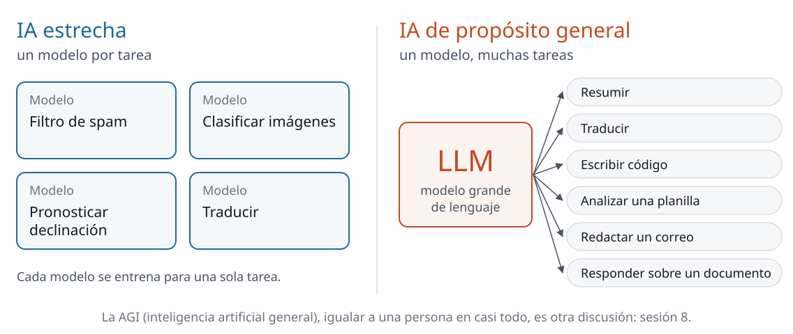
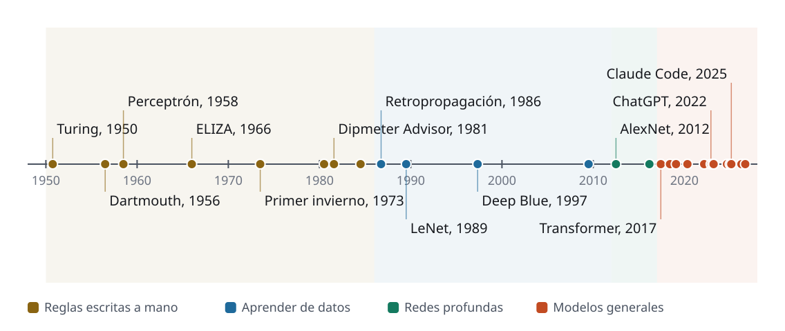
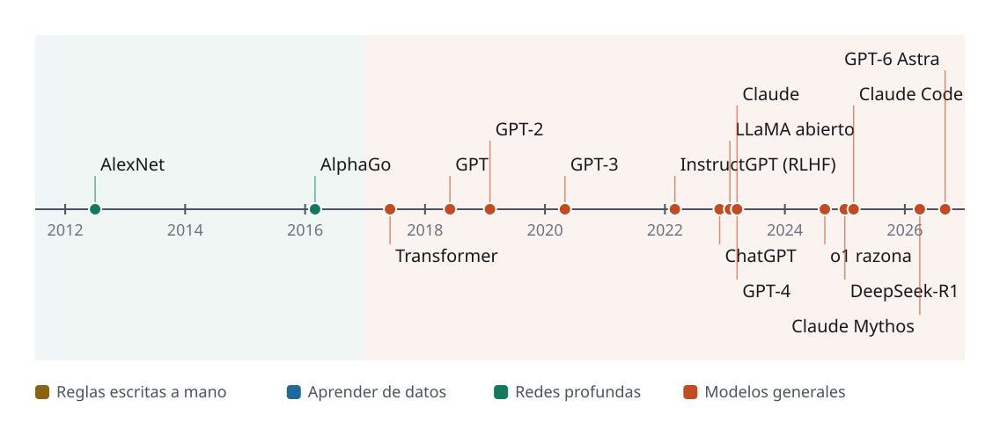
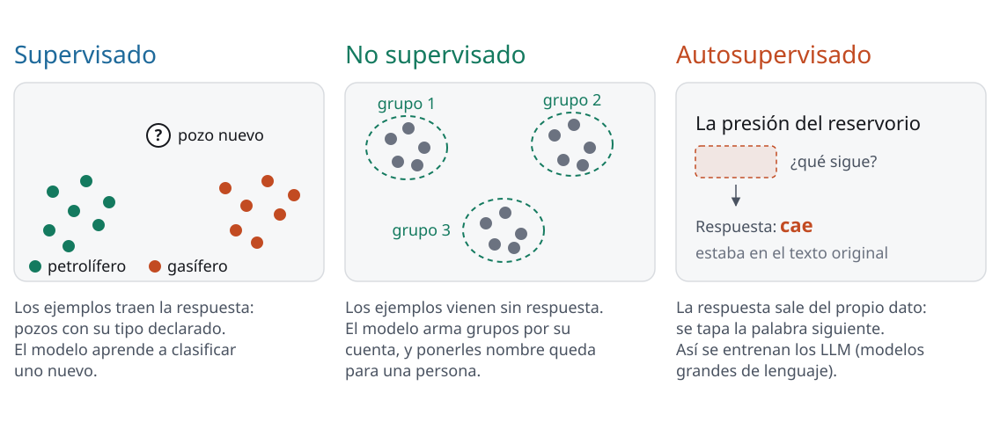
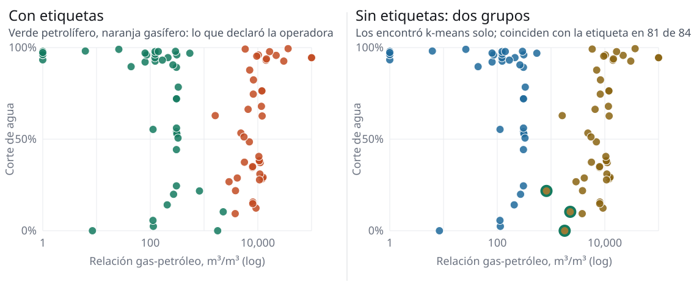
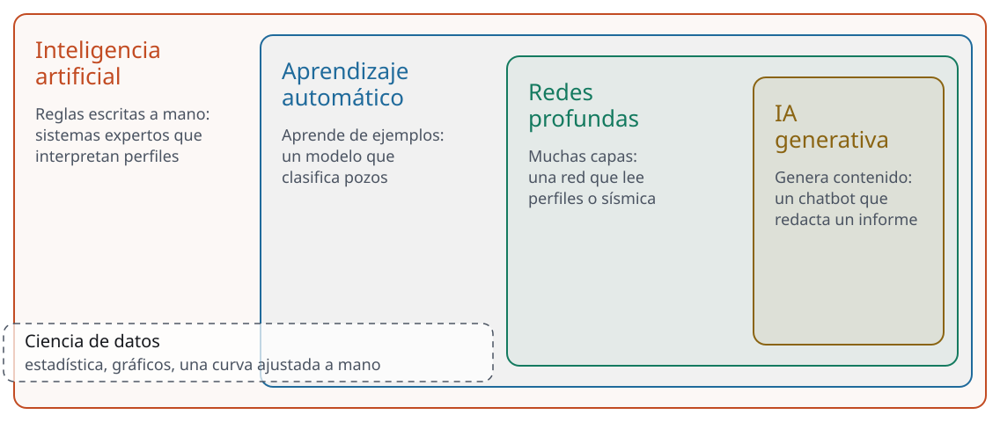

<!-- _class: portada -->

# De los datos a la IA generativa

Sesión 1 de 8 · día 1: qué es y cómo funciona · 2 h en vivo · **PCR · CGC · Tecpetrol · Andes Petroleum**

<!--
0:00 · portada mientras entra la gente
Antes de arrancar: chequear que se vea la pantalla y que se escuche.
Tener abiertas cuatro ventanas: este deck (A), el sitio del curso (C), el
chatbot (D) y duck.ai (E) con Mistral Small 4 elegido y la búsqueda web
apagada (en Tools). Esta edición no usa servidor ni PIN: todo lo que se
pregunta a la sala va por el chat de la videollamada o de viva voz.
En el escritorio, para las demos: el abstract público de SPE copiado y la foto
de la hoja de notas de reunión (a mano, inventada, sin nada de ninguna empresa).
El deck está publicado en el sitio; si alguien se cae de la videollamada,
puede seguir las slides desde ahí.
Apoyo: confirmar en el chat quién entró y quién falta; a las 10:03 arrancamos
con los que estén. Abrir un documento propio para anotar lo que la sala escribe
en el chat: expectativas, definiciones y la ronda de relevamiento. Ese documento
vuelve en la sesión 2, en la 6 y en la 8.
-->

---

<!-- _class: seccion -->

## Apertura

Bloque 1 de 7 · **20 min**

<!--
0 min · acumulado 0:00
Arranca 0:00, termina 0:20.
-->

---

<!-- _class: agenda -->

## Esta sesión

| Bloque | Tiempo | Qué hacemos |
| --- | --- | --- |
| Apertura: quiénes somos, qué esperan, el mapa del curso | 20 min | Los dos instructores, lo que cada uno se quiere llevar, una ronda de seis con nombre, empresa y rol, el mapa de los cuatro días y la regla entre empresas |
| ¿Qué es IA para vos? | 10 min | Cada uno escribe su definición en una oración, las leemos con nombre y de ahí sale la diferencia entre IA de propósito específico e IA de propósito general |
| De 1950 a hoy | 20 min | De Dartmouth y los sistemas expertos a ChatGPT, con los dos inviernos en el medio y un sistema experto que interpretaba perfiles de pozo; y dónde estamos en septiembre de 2026 |
| Cómo aprende una máquina | 23 min | Reglas escritas y reglas aprendidas: el duelo de declinación, 84 pozos reales con etiquetas y sin etiquetas, una red que lee dígitos y otra que los dibuja |
| Demos en vivo | 19 min | El chatbot frente a tareas reales: resumir un paper, escribir un correo difícil y pasar a limpio la foto de unas notas de reunión. Y verlo fallar, al lado de un modelo chico |
| Ronda de relevamiento | 10 min | Cada uno cuenta la tarea que más le come la semana y el problema que probaría primero |
| Cierre | 8 min | Por qué se equivocó el chatbot, y tres prácticas para llevarse |
| Pausa | 10 min | A las 12:00 (10:00 en Ecuador y Colombia) sigue la sesión 2 |

<!--
1 min · acumulado 0:01
Bajada: son cuatro días de cuatro horas, cada uno en dos sesiones de dos: de 10
a 12 y de 12 a 14 (de 8 a 10 y de 10 a 12 en Ecuador y Colombia). Hay una pausa
al final de la primera sesión y otra a mitad de la segunda. El mapa completo de
los cuatro días viene en unos minutos.
La misma tabla está en la página de la sesión 1: deck y sitio no se contradicen.
Apoyo: el cronómetro arranca acá; avisarme por el chat privado cuando un
bloque se pase cinco minutos.
-->

---

## Al terminar, van a poder

- Distinguir una **IA de propósito específico** de una **IA de propósito general**
- Contar cómo se llegó de los **sistemas expertos** a los modelos de hoy, y **dónde estamos** en septiembre de 2026
- Distinguir aprendizaje **supervisado** de **no supervisado**, con pozos reales
- Ver en vivo qué puede y qué **no** puede hacer hoy un chatbot, y por qué se equivoca

Es un curso para aprender a manejar: del motor vemos solo lo que ayuda a manejar mejor.

<!--
1 min · acumulado 0:02
La frase del auto es el encuadre de los cuatro días: decirla y dejarla. Nadie
sale de acá experto en machine learning; salen manejando mejor la herramienta.
El cuarto punto se arma en las demos y se cierra al final: es la primera
distinción práctica del curso, y la sesión 2 explica de dónde sale.
-->

---

<!-- _class: dupla -->

## Quiénes somos

### Matías Podeley

Ingeniero en petróleo e industrial (ITBA). Hizo el programa Energy Innovation and
Emerging Technologies de Stanford y un intercambio en informática en el INSA de Lyon, y cursa la
certificación AI Security Professional de Practical DevSecOps. Ayuda a equipos de petróleo, gas y
minería a convertir ideas en oportunidades de negocio, herramientas internas y proyectos concretos
con IA, datos, ingeniería y ciberseguridad.

### Martín Alvarado

Ingeniero de reservorios senior, con más de 25 años de
trabajo para operadoras y consultoras de todo el mundo: Halliburton, Petrobras, Pluspetrol y
Beicip-Franlab (IFPEN), y como consultor para Netherland, Sewell & Associates, Gazprom Neft, PDVSA,
GeoPark y Wintershall Noordzee, entre otras. Simulación de yacimientos, ajuste histórico,
estimación de reservas (SPE-PRMS) y recuperación mejorada.

<!--
2 min · acumulado 0:04
Un minuto cada uno, sin leer la slide. Lo que importa que entiendan del
reparto: uno mira la pantalla que se comparte y el otro mira el chat. Si tienen un
problema técnico o una pregunta que no quieren interrumpir, va por el chat y
desde el chat decidimos cuándo entra.
Apoyo: presentarse con la voz, treinta segundos, y decir cómo van a
funcionar las rondas: él nombra, el nombrado habla.
-->

---

<!-- _class: panel -->

## Entrá al sitio y dejalo abierto

`mpodeley.github.io/curso-ia-energia`

La página de la sesión 1 la usamos varias veces hoy. No hace falta usuario ni clave.

<!--
1 min · acumulado 0:05
Pegamos la dirección en el chat. Que abran la página de la sesión 1 y la
dejen en una pestaña.
Si alguien no puede entrar (firewall de la empresa), que siga desde el
celular: los ejercicios de hoy andan en el teléfono.
-->

---

<!-- _class: panel -->

## ¿Qué te querés llevar de estos cuatro días?

Escribilo en el chat en una oración, y esperá a que te indiquemos para mandarlo.

<!--
2 min · acumulado 0:07
Un minuto para escribir sin mandar. Decimos "ya" y mandan todos a la vez:
así nadie arrastra la expectativa del de al lado.
No dar ejemplos mientras escriben: cualquier ejemplo mío se copia.
Apoyo: copiar las seis oraciones, con nombre, a su documento. Vuelven el
último día, en la ronda de cierre de la sesión 8.
-->

---

<!-- _class: panel -->

## Ronda: nombre, empresa, a qué te dedicás y qué esperás

Un minuto cada uno. Contá tu rol, sin datos de la empresa, y leé tu oración del chat.

<!--
7 min · acumulado 0:14
Apoyo: llamar por nombre, en el orden de la lista de asistentes, y anotar
rol y país de cada uno. Esa lista es la que usa después para las rondas del día.
Son 4 personas en Ecuador, 1 en Argentina y 1 en Colombia; cuatro empresas.
Escuchar qué hace cada uno: los ejemplos de las demos se eligen con eso
(reservorios, producción, planificación).
Mientras hablan, anotar en qué sesión cae cada expectativa: es el material de
la slide que sigue. Cortar al minuto con amabilidad.
-->

---

## Cuatro días, un arco

| Día | De qué se trata | Sesiones |
| --- | --- | --- |
| Lunes 28 | **Qué es y cómo funciona** | 1 · De los datos a la IA generativa; 2 · Cómo funciona un LLM |
| Martes 29 | **Datos y documentos** | 3 · Prompts y datos, en la práctica; 4 · RAG y Gemini Notebook |
| Miércoles 30 | **Agentes** | 5 · Qué son, el arnés y cuáles hay; 6 · Agentes y el caso de tu empresa |
| Jueves 1 | **Riesgos y el caso real** | 7 · Información, riesgos y política de uso; 8 · El caso y el horizonte |

Te llevás criterio para delegar y verificar, un cuaderno del rubro, un borrador de política de uso y el caso de tu empresa.

<!--
4 min · acumulado 0:18
Cada día, la primera sesión de 10 a 12 y la segunda de 12 a 14 (de 8 a 10 y de
10 a 12 en Ecuador y Colombia).
Recorrer el arco en una frase por día: el lunes entender qué es esto y cómo
funciona; el martes ponerlo a trabajar con datos y con tus documentos; el
miércoles los agentes y el caso de tu empresa; el jueves usarlo con cabeza, y el
caso real de punta a punta.
Después, ubicar en el mapa las expectativas que acabamos de escuchar, con
nombre: "lo de Fulano cae el martes". Si alguna no cae en ningún día, decirlo
de frente: el curso no entrena modelos, no conecta sistemas de la empresa y
trabaja con datos públicos.
Cómo funciona: cada sesión tiene su página, su deck y un quiz para repasar;
entre día y día hay una sola tarea, de cinco minutos; las preguntas que no
quieran hacer en voz alta van por el chat, y desde ahí decidimos cuándo entran.
Gemini Notebook es el nombre nuevo de NotebookLM, desde julio: si alguien lo
conoce por el viejo, es lo mismo.
-->

---

<!-- _class: cita -->

## En estos ejercicios **no** usamos datos confidenciales de ninguna empresa

Hay cuatro empresas en la sala. Ni volúmenes reales de producción, ni nombres de contratos, ni
información de partners: nada de eso va al chat ni a un chatbot gratuito. Los ejemplos salen de
fuentes públicas: el reporte diario de la ARCH y el Capítulo IV.

<!--
2 min · acumulado 0:20
La regla del día uno, temprano y grande, y hoy con una razón extra: en la
sala hay competidores. Ninguna ronda pide un dato propio; cuando pida "una
tarea de tu semana", alcanza con describir el tipo de tarea, sin su contenido.
ARCH: Agencia de Regulación y Control de Hidrocarburos, Ecuador. Capítulo IV:
producción por pozo de la Secretaría de Energía, Argentina. Decir los nombres
completos una vez.
La razón la mostramos en la sesión 7: qué pasa con lo que se sube a un
chatbot gratuito. Si alguien pregunta por la versión empresarial: existe, cambia
el contrato de datos, lo vemos mañana en la sesión 3. Hoy trabajamos con cuentas gratuitas.
Cierre del bloque 1.
-->

---

<!-- _class: seccion -->

## ¿Qué es IA para vos?

Bloque 2 de 7 · **10 min**

<!--
0 min · acumulado 0:20
Arranca 0:20, termina 0:30.
-->

---

<!-- _class: panel -->

## En una oración: ¿qué es la inteligencia artificial para vos?

Escribila en el chat, sin buscar, y esperá a que te indiquemos para mandarla.

<!--
2 min · acumulado 0:22
Un minuto y medio para escribir sin mandar; decimos "ya" y mandan todos a
la vez. Mientras escriben, no dar ejemplos de definiciones: cualquier ejemplo
mío arrastra las de ellos.
Apoyo: copiar las seis, con nombre, a su documento. Vuelven al cierre de la
sesión 2 ("¿cambiarías tu definición?").
-->

---

<!-- _class: panel -->

## Las definiciones de ustedes

Una por persona, con su nombre. Las leemos y las agrupamos.

<!--
4 min · acumulado 0:26
Leerlas en voz alta desde el chat y agruparlas en familias, sin corregir ninguna:
- las que hablan de hacer tareas (resolver, automatizar, ayudar);
- las que hablan de imitar a una persona;
- las que hablan de aprender de datos o de patrones;
- las que hablan de pensar, entender o razonar.
Apoyo: llamar a dos por nombre, con una repregunta: "¿por qué esa palabra?".
El campo tampoco tiene una definición cerrada: Turing la planteó en 1950 como
un juego de imitación, una conversación escrita donde la máquina intenta pasar
por persona; en Dartmouth, en 1956, el proyecto se propuso describir la
inteligencia con tanta precisión que una máquina pudiera simularla. Las dos
están en la línea de tiempo que sigue.
El puente al slide siguiente: casi todas las definiciones describen algo que
resuelve una tarea. La pregunta es cuántas.
-->

---

<!-- _class: figura -->

## Una tarea o muchas

En este curso, general quiere decir de propósito general: un mismo modelo para muchas tareas.

<!--
4 min · acumulado 0:30
IA de propósito específico: un modelo por tarea. El filtro de spam, el
clasificador de imágenes, el modelo que pronostica una declinación. Deep Blue,
que le ganó a Kasparov en 1997, es el ejemplo clásico: un sistema construido
para una sola tarea (hito de la línea de tiempo).
IA de propósito general: el mismo modelo resume, traduce, escribe código,
analiza una planilla y redacta un correo. Eso es lo que llegó a todos los
escritorios con ChatGPT, a fines de 2022.
Volver a las definiciones del chat: ¿cuáles describían una IA de propósito
específico y cuáles una de propósito general? Una o dos, no más.
Si alguien pregunta por la AGI: la definición y la discusión están en la
sesión 8; hoy alcanza con separar las dos ideas.
Cierre del bloque 2.
-->

---

<!-- _class: seccion -->

## De 1950 a hoy

Bloque 3 de 7 · **20 min**

<!--
0 min · acumulado 0:30
Arranca 0:30, termina 0:50. Doce minutos de historia y ocho de presente.
-->

---

<!-- _class: figura -->

## De Turing a hoy, en cuatro eras

Cada hito tiene su fuente en la línea de tiempo interactiva de la página de la sesión 1.

<!--
2 min · acumulado 0:32
Recorrer las cuatro bandas de izquierda a derecha, sin leer los hitos: lo que
cambia de una era a la otra es quién escribe las reglas. En la primera las
escribe una persona; en la segunda la máquina las encuentra en los datos; en
la tercera, con redes de muchas capas, aprende hasta la forma de la función;
en la cuarta, un mismo modelo sirve para muchas tareas.
La línea completa, con cada hito y su fuente, queda en la página para verla
después.
-->

---

## Reglas escritas a mano, y dos inviernos

- **1956, Dartmouth**: un proyecto de verano busca describir la inteligencia con tanta precisión que una máquina pueda simularla. De ahí sale el nombre del campo
- **1981, Dipmeter Advisor**: el MIT y Schlumberger arman un sistema experto que infiere la estructura geológica a partir del perfil de buzamiento
- **1973 y 1984, dos inviernos**: el informe Lighthill en el Reino Unido, y la Asociación Estadounidense de IA (AAAI) advirtiendo que las expectativas estaban demasiado altas

<!--
3 min · acumulado 0:35
Sistemas expertos: sacarle el conocimiento a un especialista y escribirlo
como reglas del tipo "si pasa esto, hacé aquello". R1, en 1980, configuraba
computadoras con 772 reglas.
El ancla de la industria es el Dipmeter Advisor: la IA llegó al pozo hace más
de cuarenta años, imitando a los intérpretes expertos en una tarea que se
aprende con años de práctica. Preguntar si alguien trabajó con perfiles de
buzamiento. MIT: Instituto Tecnológico de Massachusetts.
Un invierno es un período en que el campo pierde la confianza de quienes lo
financian y lo usan. El detalle que le habla a esta sala: en 1984 la
industria ya era cliente de los sistemas expertos, y la advertencia de la AAAI
nombra a Schlumberger y a Texas Instruments perdiendo interés.
Pregunta para la sala, sin responderla yo: ¿se parece en algo al momento
actual? Una voz, medio minuto. La conversación sobre el futuro es de la sesión 8.
-->

---

## Aprender de datos

- **1986**: la retropropagación entrena redes con capas ocultas a partir de sus errores
- **1989**: una red de los Laboratorios Bell lee los códigos postales
- **1997**: Deep Blue le gana a Kasparov; IA de propósito específico, una sola tarea
- **2009**: ImageNet, 3.2 millones de imágenes etiquetadas por personas
- **2012**: AlexNet gana ImageNet con 15.3% de error contra 26.2%, en dos placas gráficas (GPU)

<!--
2 min · acumulado 0:37
La regla pasa a encontrarla la máquina mirando ejemplos. Deep Blue queda como
contraejemplo: gana al campeón del mundo en una sola tarea.
AlexNet junta los tres ingredientes de lo que sigue: muchos datos etiquetados,
cómputo en placas gráficas y redes con muchas capas. El video de LeNet está
en el material de esta página; el de AlexNet abre el de la sesión 2.
GPU: unidad de procesamiento gráfico, las placas de los videojuegos.
-->

---

<!-- _class: figura -->

## Los últimos quince años, de AlexNet a hoy

2017, el transformer. 2022, ChatGPT. 2024, modelos que razonan antes de responder. 2025, agentes como Claude Code.

<!--
3 min · acumulado 0:40
Leer el camino en cinco pasos, con el dedo en la figura:
1) 2017, el transformer (Google): una arquitectura más paralelizable y mucho
   más rápida de entrenar. Todo lo que sigue se construye sobre ella.
2) 2018 a 2020, GPT, GPT-2 y GPT-3: leer texto sin etiquetar y predecir la
   palabra siguiente; GPT-3 ya traduce y responde preguntas sin reentrenarlo.
3) En marzo de 2022, InstructGPT: personas le enseñan a seguir instrucciones
   (aprendizaje por refuerzo con retroalimentación humana, RLHF). El 30 de
   noviembre de 2022 sale ChatGPT, con ese mismo entrenamiento.
4) 2024, o1: modelos que razonan paso a paso antes de responder.
5) 2025, Claude Code: el modelo general con herramientas y un loop, que pasa
   de conversar a hacer (lo vemos el miércoles).
Los dos últimos hitos, de 2026, son el puente a lo que sigue: hoy.
Cómo funciona cada paso es la sesión 2. Acá alcanza con el mapa.
-->

---

<!-- _class: acentos -->

## Tres cosas que se juntaron

- **Datos**: todo el texto de internet, disponible y digitalizado
- **Cómputo**: las placas gráficas (GPU), que resultaron ser justo la máquina que estos modelos necesitaban
- **Una arquitectura que escala**: el *transformer*, 2017

<!--
2 min · acumulado 0:42
La respuesta a "¿por qué ahora y no en 2010?". En las hipótesis suele salir
"más computadoras", que es un tercio de la respuesta.
Lo importante del transformer es que mejora al agrandarlo, de forma
predecible. Eso convirtió la investigación en ingeniería: si duplico datos y
cómputo, sé aproximadamente cuánto mejora. Consecuencia práctica: lo que hoy
no funciona bien probablemente funcione mejor en un año; lo que falla por
diseño (las alucinaciones, sesión 2) no se arregla solo agrandando.
-->

---

## Dónde estamos hoy: la frontera se movió este mes

- **2 de septiembre**: Google presenta Gemini 3.8 Flash
- **3 de septiembre**: OpenAI presenta GPT-6 Astra, solo para planes pagos
- **22 de septiembre**: Anthropic presenta Claude Opus 5.5
- Los **modelos abiertos**, que cualquiera descarga y corre en una máquina propia, quedaron cerca: Kimi K3, Qwen3.8, DeepSeek V4

El nombre del modelo envejece en meses. Lo que conviene seguir es qué puede hacer.

<!--
2 min · acumulado 0:44
Foto al 25 de septiembre de 2026; las fuentes están en la página.
Los modelos grandes de OpenAI y de Anthropic leen hasta un millón de tokens de
una vez (qué es un token, en la sesión 2): un informe de cientos de páginas
entra entero.
Un dato que no estaba hace un año: los laboratorios guardan sus modelos más
fuertes por riesgo de ciberseguridad. Anthropic no publicó Claude Mythos
Preview en abril porque encontraba y explotaba fallas de seguridad en sistemas
operativos y navegadores; se lo dio primero a quienes defienden esos sistemas.
Es el hito de 2026 de la línea de tiempo, y vuelve en la sesión 7.
No hace falta retener un solo nombre de esta slide.
-->

---

<!-- _class: acentos -->

## Qué cambió desde 2024

- **Piensa antes de responder**: los modelos de razonamiento se toman tiempo, y con más tiempo aciertan más
- **Hace**: los agentes buscan, leen, editan archivos y usan programas, y ya trabajan desde el escritorio de la computadora
- **Ve y escucha**: fotos, documentos escaneados, voz
- **Cuesta cada vez menos**: el mismo desempeño se abarata cerca de 47% por trimestre (Epoch AI, septiembre de 2026)

<!--
2 min · acumulado 0:46
Razonar: lo que abrió o1 en 2024 hoy lo traen todos los grandes.
Hacer: ChatGPT Work y Claude Cowork trabajan sobre los archivos de la
computadora; Claude Code, en la terminal. En mayo de 2026, METR midió que el
modelo más fuerte de Anthropic completaba la mitad de las veces tareas que a un
experto le llevan al menos 16 horas, el techo de lo que su batería de pruebas
puede medir. Qué se le delega hoy a un agente y dónde se rompe, el miércoles (sesiones 5 y 6).
Ver y escuchar: la demo de la foto de este mismo bloque de demos sale de acá.
Costo: Epoch AI midió que el costo de llegar a un mismo nivel de desempeño cae
cerca de 47% por trimestre, unas 13 veces por año. Lo que hoy es caro para
automatizar en una empresa, en un año cuesta una fracción.
-->

---

## Qué trae hoy una cuenta gratuita

| Chatbot | Modelo | Lo que suma |
| --- | --- | --- |
| ChatGPT | el chico de OpenAI | Búsqueda, voz, archivos e investigación profunda, con límites |
| Claude | Sonnet y Haiku | Búsqueda, voz, y crea planillas y documentos |
| Gemini | Flash y algo de Pro | Deep Research y conversación por voz; lee menos texto por vez |
| Gemini Notebook, antes NotebookLM | Gemini | Responde a partir de tus documentos, hasta 50 por cuaderno |

Foto al 25 de septiembre de 2026: los límites cambian seguido.

<!--
3 min · acumulado 0:49
Lo que trae la cuenta gratuita alcanza para todo el curso. Conviene tener dos,
para comparar: lo hacemos mañana en la sesión 3.
"Lee menos texto por vez": la ventana de contexto de la cuenta gratuita de
Gemini es de 32,000 tokens, contra un millón de los modelos grandes. Qué es la
ventana y por qué importa es la sesión 2.
Gemini Notebook es el cuaderno del martes a la tarde (sesión 4).
Si preguntan por las versiones pagas o empresariales: cambian el modelo, los
límites y el contrato de datos; lo del contrato es la sesión 3.
Preguntar a la sala, a mano alzada: ¿quién usa alguno de estos todas las
semanas? Se cuentan en voz alta.
-->

---

## Quién lo usa, y qué ya rinde en la industria

- **Más de 1,000 millones de personas por semana** usan productos de OpenAI (septiembre de 2026)
- **Equinor** ahorró **USD 130 millones** con IA en 2025, sobre todo con aprendizaje automático sobre sus datos de operación
- **ADNOC** contrató en 2025 agentes para interpretación sísmica y modelado de reservorios en más de 28 campos
- **Petrobras** tiene desde 2023 un chatbot interno para más de 100 mil personas

<!--
1 min · acumulado 0:50
Lo que ya rinde plata en la industria es, en su mayoría, el aprendizaje
automático de la próxima media hora: sísmica, mantenimiento predictivo,
optimización. La IA generativa se suma a eso, y los casos con resultado
medido todavía son pocos.
Fuentes en la página: Equinor (enero de 2026), el contrato de AIQ con ADNOC
(marzo de 2025) y Petrobras (diciembre de 2023).
Si hay tiempo, dos datos para la sala: según el Stanford AI Index 2026, la IA
generativa llegó a 53% de adopción en tres años, más rápido que la computadora
personal o internet; y en la encuesta de McKinsey de agosto, 80% de los que la
usan dicen que les subió la productividad personal, pero solo 37% de las
empresas ve impacto en el resultado. La distancia entre las dos cifras es el
trabajo de la sesión 6 y de la hoja de ruta de la sesión 8.
Cierre del bloque 3.
-->

---

<!-- _class: seccion -->

## Cómo aprende una máquina

Bloque 4 de 7 · **23 min**

<!--
0 min · acumulado 0:50
Arranca 0:50, termina 1:13.
-->

---

## Reglas escritas y reglas aprendidas

En un sistema experto, **la regla la escribe una persona**.

En el aprendizaje automático (*machine learning*), **la máquina encuentra la regla mirando
ejemplos**. Sirve cuando la fórmula no existe o no la conocemos.

Y en el medio está lo que siempre hicimos: **una curva de declinación ajustada a mano ya es un
modelo**. La fórmula la ponés vos, y los datos ponen los parámetros.

<!--
1 min · acumulado 0:51
Para los que no son de reservorios (planning, administración): la línea de
tendencia en Excel es el mismo gesto, sobre costos, demanda o avance de obra.
Si preguntan por la regresión lineal: es estadística cuando la usás para
entender (coeficientes, significancia) y es machine learning cuando la máquina
elige sola los parámetros para predecir y se la valida con datos que no vio.
Entregar al ejercicio: "no se los voy a contar, lo van a hacer ustedes".
-->

---

<!-- _class: panel -->

## Ajustala vos

En la página de la sesión 1, el duelo de declinación.

Dos perillas y un número que tiene que bajar: el error. Bajalo todo lo que puedas.

Si ya lo hiciste antes de hoy, apretá "Reiniciar ejercicio" y arrancá de cero.

<!--
5 min · acumulado 0:56
Ventana C (el sitio), página de la sesión 1, ejercicio "Ajustala vos, después que
la busque la máquina".
ANTES de proyectar: apretar "Reiniciar ejercicio". Si ensayé antes de la clase,
el navegador se acuerda y el ejercicio abre con la respuesta puesta.
Arranca en una recta plana, con 66% de error. En tres minutos la mayoría llega
a algo entre 3% y 8%. El mejor ajuste posible con estas perillas es 2.17%.
Que aprieten "Listo, este es mi ajuste" antes de seguir.
Mientras trabajan, decir en voz alta que esto es la regla escrita a mano:
eligieron una forma funcional y estimaron los parámetros a ojo.
Apoyo: pedir por el chat que cada uno escriba su error cuando aprieta
"Listo"; leo los seis números en voz alta antes de pasar a la máquina.
-->

---

<!-- _class: panel -->

## Ahora que la busque la máquina

El botón está abajo del gráfico. La máquina tiene los puntos y un criterio, y los valores los encuentra sola.

<!--
3 min · acumulado 0:59
Ventana C otra vez. Que aprieten "Que la busque la máquina".
Leer la tabla en voz alta: su ajuste contra el de ella. Casi siempre gana la
máquina, y por el doble: 1.06% contra el 2.17% del mejor ajuste posible a mano.
Abrir el desplegable "Los valores con los que se generó esta curva": qi 320 y
Di 2.1%/mes. La máquina cayó justo encima sin que nadie se los dijera.
Ni con los valores exactos el error da cero: queda 1.06%, que es el ruido de
medición. Un modelo que llega a cero está copiando el ruido.
Puente: esto ya es aprendizaje supervisado. Cada punto trae su respuesta, el
caudal que el pozo produjo ese mes, y la máquina busca la curva que mejor la
reproduce.
-->

---

<!-- _class: figura -->

## Tres maneras de aprender

Hoy vemos las dos primeras con pozos reales. La tercera es la que usan los modelos de lenguaje: la sesión 2 arranca por ahí.

<!--
2 min · acumulado 1:01
Supervisado: los ejemplos traen la respuesta. El duelo que acaban de hacer, y
los pozos con el tipo que declaró la operadora.
No supervisado: los ejemplos vienen sin respuesta; la máquina arma grupos por
su cuenta, y ponerles nombre queda para una persona.
Autosupervisado: la respuesta sale del propio dato. Se tapa la palabra
siguiente de un texto y el modelo intenta adivinarla. Una línea y nada más:
es el arranque de la sesión 2.
-->

---

<!-- _class: panel -->

## Los mismos pozos, con etiquetas y sin etiquetas

En la página de la sesión 1, abajo del duelo.

84 pozos activos de la cuenca Noroeste, del Capítulo IV. Probá las dos pestañas.

<!--
5 min · acumulado 1:06
Ventana C, ejercicio "Los mismos pozos, con etiquetas y sin etiquetas". Dos
ejes que cualquier ingeniero lee de un vistazo: la relación gas-petróleo
(RGP, escala logarítmica) y el corte de agua de los últimos doce meses.
Con etiquetas: que ubiquen un pozo nuevo tocando el gráfico. Los cinco vecinos
más cercanos votan el tipo. El recuadro "aciertos tapando cada etiqueta" dice
cuántas veces acierta si se tapa el tipo de cada pozo y se lo predice con los
demás: con los datos de hoy, 82 de 84. Leer el número de la pantalla, que se
calcula en vivo.
Sin etiquetas: "Buscar 2 grupos" y después "Comparar con las etiquetas". Sin
haber visto nunca el tipo declarado, la máquina separa los pozos casi igual
que la operadora: con los datos de hoy, 81 de 84.
Apoyo: pedir que uno por empresa diga en el chat qué predijo su pozo nuevo.
-->

---

<!-- _class: figura -->

## Lo que encontró la máquina, y lo que queda para ustedes

Los que caen en el grupo equivocado son los interesantes: petrolíferos con relación gas-petróleo de pozo de gas.

<!--
2 min · acumulado 1:08
Preguntar a la sala qué puede explicar esos tres pozos: casquete de gas, una
etiqueta vieja que nadie actualizó, un pozo que cambió con los años. Para
responderlo hace falta conocer el yacimiento. Ponerles nombre a los grupos es
trabajo de una persona.
Detalle para los curiosos: los grupos dependen de cómo se mide la distancia.
Acá una década de RGP pesa lo mismo que todo el rango del corte de agua; con
otra escala, los grupos cambian. Está explicado en la página.
-->

---

<!-- _class: figura -->

## Cuatro capas, una dentro de otra

Cada capa se apoya en la anterior, que sigue vigente.

<!--
2 min · acumulado 1:10
Recorrer de afuera hacia adentro con el ejemplo de cada capa. La inteligencia
artificial incluye los sistemas expertos de reglas escritas; el aprendizaje
automático, lo que acabamos de hacer con los pozos; las redes profundas son
aprendizaje automático con muchas capas, donde entran la sísmica, los
registros de pozo y el texto, y la red aprende hasta la forma de la función;
la IA generativa, el chatbot. Los modelos grandes de lenguaje (LLM) son redes
profundas llevadas al extremo.
Todo lo de afuera sigue siendo la herramienta correcta para la mayoría de los
problemas con números: el chatbot se suma a lo que ya había. Es lo mismo que
dijimos de Equinor hace veinte minutos.
Puente: una red de verdad, en la página.
-->

---

<!-- _class: panel -->

## Una red que lee dígitos, y otra que los dibuja

En la página de la sesión 1, abajo de las cuatro capas.

Dibujá un dígito del 0 al 9, con el mouse o con el dedo, y mirá cómo se encienden las neuronas.

<!--
3 min · acumulado 1:13
Ventana C, ejercicio "Una red que lee dígitos". Dibujo un 3 en vivo: mientras
dibujo se encienden las neuronas del medio y cambia el porcentaje.
Leer el diagrama de izquierda a derecha: el dibujo como lo recibe la red (784
números), las 64 neuronas que se encienden, los diez dígitos. Tocar una
neurona: el patrón de trazos al que responde. Nadie se lo asignó; la red
ajustó casi 51,000 pesos mirando 60,000 dígitos que traían su respuesta. Es el
problema de la red de los Laboratorios Bell de 1989, la de los códigos
postales, que vimos en la línea de tiempo.
Minuto y medio para eso, y bajar al ejercicio siguiente, "La red al revés":
elegir el 7 y apretar "Imaginar otros" dos veces. Otra red, con los mismos
dígitos, hace el camino inverso: recibe el número y lo dibuja, cada vez
distinto. Es la capa de IA generativa en miniatura, y el puente al chatbot:
un modelo de lenguaje hace lo mismo con texto.
Si preguntan: la que lee tiene una sola capa oculta; las profundas apilan
decenas, con el mismo principio. Si lee mal alguno, comentarlo al pasar: en
los 10,000 dígitos de prueba acierta el 97.9%. No forzar la falla.
Apoyo: pedir que cada uno dibuje un dígito y escriba en el chat si lo leyó bien.
Puente a las demos: ahora sí, el chatbot.
Cierre del bloque 4.
-->

---

<!-- _class: seccion -->

## Demos en vivo

Bloque 5 de 7 · **19 min**

<!--
0 min · acumulado 1:13
Arranca 1:13, termina 1:32.
-->

---

## Tres tareas reales

- Resumir un **paper de la Society of Petroleum Engineers (SPE)**
- Redactar un **correo difícil**
- Pasar a limpio la **foto de unas notas de reunión** escritas a mano

Y la cuarta, la más importante, es **verlo fallar**.

<!--
1 min · acumulado 1:14
Avisar que las tres las hago en vivo y que van a ver los errores también.
La tabla de producción sale de acá a propósito: mañana, en la sesión 3, dos PDF
oficiales de Ecuador se cruzan entre sí, y hacerla dos veces no agrega nada.
Pedir que mientras miran anoten: ¿esto me serviría mañana en mi trabajo?
Los tres prompts quedan en la página de la sesión 1, listos para copiar.
-->

---

<!-- _class: panel -->

## Vamos al chatbot

Miren tres cosas: qué tan rápido responde, qué tan seguro suena, y si lo que dice es **verdad**.

<!--
7 min · acumulado 1:21
Cambiar a la ventana D (chatbot). Prompts exactos, en orden:

1) "Resumí este resumen de paper de la SPE en cinco viñetas para un gerente que
   no es ingeniero de reservorios: <pegar abstract público>"

2) "Redactá un correo para avisarle a un contratista que vamos a postergar una
   intervención dos semanas por disponibilidad de equipo. Tono cordial pero firme,
   sin comprometer fecha nueva."

3) Subir la foto de la hoja de notas y pedir: "Estas son mis notas de una
   reunión. Pasalas a una lista de pendientes con responsable y fecha. Si algo
   no se lee o no tiene responsable, marcalo con [?] en lugar de completarlo."
   Después, con la foto al lado, verificar pendiente por pendiente: ¿inventó un
   responsable, una fecha o un pendiente que no estaba? Es el chequeo que tiene
   que quedar. Decir al pasar que lo mismo se hace desde el celular: la app del
   chatbot tiene la cámara.

Reserva, si una demo falla por algo técnico: "Explicá qué es la recuperación
secundaria por inyección de agua como si le hablaras a un directorio no técnico.
Máximo 150 palabras, sin fórmulas." (es el tema del caso de la sesión 8).
Apoyo: pegar cada prompt en el chat apenas lo corro. Después de la tercera,
un nombre: "¿te sirve tal cual, o qué le cambiarías?". Una sola respuesta: el
bloque tiene 7 minutos.
Volver al deck en la slide siguiente.
-->

---

## Qué acabamos de ver

Respondió rápido, ordenado y con buen tono, **sin ninguna garantía de que sea cierto**.

El chatbot no tiene un botón de "no sé". Cuando no sabe, sigue escribiendo igual.

<!--
1 min · acumulado 1:22
Puente al fallo deliberado. Preguntar si alguien notó algo raro en las respuestas
anteriores; a veces ya lo cazaron solos y es mejor si sale de ellos. En la
foto, lo más común es un responsable o una fecha que no estaban en la hoja.
-->

---

<!-- _class: panel -->

## Ahora, a hacerlo fallar

<!--
7 min · acumulado 1:29
Dos modelos lado a lado: la cuenta gratuita de Gemini (Flash, ventana D) y
Mistral Small 4 en duck.ai (ventana E), un modelo más chico, gratis y sin
cuenta. A los dos, sin búsqueda: a Gemini se lo pido en el primer mensaje; en
duck.ai, Web Search queda apagado en Tools. La tercera familia (la norma real con contenido inventado)
queda para el bloque de alucinaciones de la sesión 2.

1) En Gemini: "¿Cuánto produjo el campo Sacha el 15 de septiembre de 2026
   según el reporte diario de la ARCH?"
   Lo más probable es que conteste que no tiene ese dato: es el avance desde
   2023, y hay que decirlo así. Sacha es de Petroecuador, público, y de nadie
   en la sala.

2) En Mistral: "¿Quién descubrió el campo Sacha, en qué año, y cuánto produce
   hoy?" y "Citame tres papers de la SPE sobre recuperación secundaria en
   areniscas de la cuenca Oriente, con su número de SPE."
   SIN ENSAYAR (duck.ai no deja automatizar): probarlo antes del lunes y
   quedarse con la que falle. Si Mistral acierta todo, Gemma 4 31B en el mismo
   selector. Como referencia, Llama 3.2 1B (local, en Ollama) inventó en 6 de
   6: Sacha salió cancha de fútbol, mina de sal y campo agrícola.

3) La primera de la 2 en Gemini. Lo real: el consorcio Texaco-Gulf lo
   descubrió con el pozo Sacha-1 en febrero de 1969, y según Primicias
   (24-sep-2026) produjo 71,536 barriles por día en promedio entre enero y
   agosto. Si da una cifra "de hoy", preguntarle de qué fecha es: sale de su
   entrenamiento.

Qué decir: el mecanismo que inventa es el mismo en los dos. Al grande le
enseñaron a frenarse cuando le falta el dato, y aun así, cuando inventa,
inventa algo creíble: ese es el que hay que verificar.
Verificar UNA en vivo, buscándola: la del reporte diario, abriendo el PDF de
la ARCH en controlhidrocarburos.gob.ec. Que vean el chequeo completo.
Comentar al pasar, sin slide, las dos causas. A Gemini le faltaba el dato:
nunca leyó el reporte de hoy, y si da una cifra es la más creíble de su
entrenamiento. Los números de SPE inventados son lo otro: no existen en
ninguna parte, y aun así salen con la forma exacta de una cita. La primera
se arregla trayéndole el documento (sesión 4); la segunda hay que verificarla
(sesión 7). El cierre retoma esta distinción.
El POR QUÉ viene después de la pausa: no adelantarlo.
Volver al deck.
-->

---

<!-- _class: cita -->

## La salida de un LLM es un **borrador plausible**: se verifica antes de usarlo

<!--
1 min · acumulado 1:30
La regla que nos acompaña los cuatro días.
En la sesión 2, después de la pausa, vemos POR QUÉ pasa esto: sale del mecanismo mismo, así que
nadie lo va a arreglar con un parche.
-->

---

<!-- _class: panel -->

## ¿Cuánto confiarías ahora?

Del 1 (nada) al 5 (mucho): ¿cuánto confiarías en una respuesta sin verificarla? Un número en el chat, cuando te indiquemos.

<!--
2 min · acumulado 1:32
Decimos "ya" y mandan todos a la vez, para que nadie ancle su número en el
de los demás. Leer los seis en voz alta.
Es la confianza declarada después de ver fallar al modelo: contrastarla con el
tono de las definiciones del arranque.
Cierre del bloque 5.
-->

---

<!-- _class: seccion -->

## Ronda de relevamiento

Bloque 6 de 7 · **10 min**

<!--
0 min · acumulado 1:32
Arranca 1:32, termina 1:42.
-->

---

## Lo que falta saber es lo de ustedes

El caso real de la sesión 8 ya está armado sobre datos públicos. Para que los ejemplos de estos
cuatro días hablen de su trabajo, dos preguntas para cada uno:

1. ¿Qué **tarea repetitiva** te come más tiempo en la semana?
2. Si tuvieras que elegir **un solo problema** de tu área para probar primero con estas herramientas, ¿cuál sería?

<!--
1 min · acumulado 1:33
Este es el bloque que hace que el curso valga distinto a un tutorial de YouTube.
Decirlo así, sin vueltas.
Solo el tipo de tarea y de problema, sin contenido de la empresa: hay cuatro en
la sala. La segunda respuesta es la semilla del taller de la sesión 6, donde
cada empresa escribe su caso en una página.
-->

---

<!-- _class: panel -->

## Ronda: tu tarea y tu problema

Un minuto y medio cada uno, cuando te indiquemos.

<!--
9 min · acumulado 1:42
Apoyo: ronda completa con nombre, en el mismo orden de la apertura, y anotar
las dos respuestas de cada uno en su documento. No preguntar al aire.
Repreguntar una sola cosa por persona, la que más ayude a elegir ejemplos:
"¿en qué formato viven esos datos?" (planilla, PDF, sistema, papel).
Anotar todo: esto alimenta los ejemplos de mañana y el taller del miércoles.
Si alguien no tiene un problema claro, que arranque por la tarea repetitiva:
alcanza.
Cierre del bloque 6.
-->

---

<!-- _class: seccion -->

## Cierre

Bloque 7 de 7 · **8 min**

<!--
0 min · acumulado 1:42
Arranca 1:42, termina 1:50.
-->

---

## El chatbot respondió algo incorrecto con total seguridad

¿Le **faltaba el dato**, o el dato **no existía** y lo completó igual?

<!--
5 min · acumulado 1:47
Pide un diagnóstico: que clasifiquen cada error que vieron en una de las dos
causas. Dos o tres voces, llamadas por nombre.
Buscar que salga la idea de "verificable": las tareas donde puedo comprobar el
resultado rápido son las tareas seguras. La foto de las notas es el ejemplo:
el original está al lado.
Si sale "entonces no sirve", repreguntar: ¿un borrador de un pasante sirve?
-->

---

<!-- _class: acentos -->

## Qué te llevás de esta sesión

- **Pedile un borrador, y verificalo** contra el original antes de usarlo
- **Probá con una foto**: tus notas de la próxima reunión, pasadas a pendientes con responsable
- **Nada de la empresa** en una cuenta gratuita

<!--
3 min · acumulado 1:50
Tres prácticas en palabras llanas, para aplicar mañana mismo. La segunda es
la más fácil de probar: la próxima reunión que tengan.
Cierre del bloque 7 y de la sesión 1.
-->

---

## Pausa · 10 min

A las 12:00 (10:00 en Ecuador y Colombia) sigue la **sesión 2**, con su propio deck.
Dejá abierta la página de la sesión 2 y el chatbot.

<!--
10 min · acumulado 2:00
Cortar el audio y dejar la pantalla compartida, con esta slide proyectada.
En la pausa, abrir el deck de la sesión 2 en la ventana A y dejarlo en la
portada; las otras ventanas quedan como están.
Apoyo: releer lo que anotó de la ronda de relevamiento y pasarme en una línea
cualquier tarea que sirva de ejemplo para la sesión 2. Avisar por el chat un
minuto antes de volver.
-->
