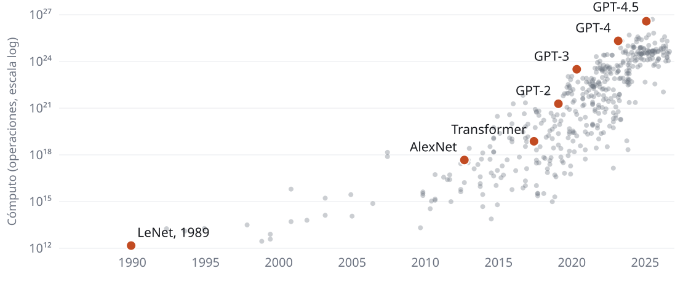
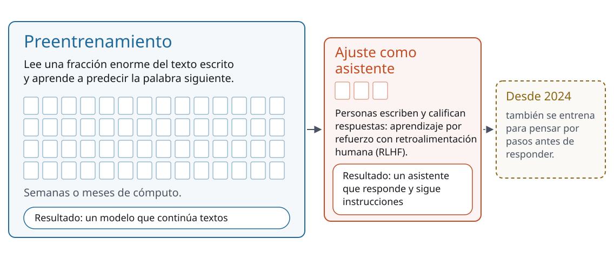

<!-- _class: portada -->

# Cómo funciona un LLM

Sesión 2 de 8 · día 1: qué es y cómo funciona · 2 h en vivo · **PCR · CGC · Tecpetrol · Andes Petroleum**

<!--
0:00 · portada mientras vuelven de la pausa
Este deck se abrió en la ventana A durante la pausa; las otras ventanas
siguen como estaban: el sitio del curso (C) y el chatbot (D). Todo lo que se
pregunta a la sala va por el chat de la videollamada.
Martín: confirmar en el chat que volvieron los seis; a las 12:01 arrancamos
con los que estén.
-->

---

<!-- _class: seccion -->

## Tokens y predicción

Bloque 1 de 5 · **33 min**

<!--
0 min · acumulado 0:00
Arranca 0:00, termina 0:33. Incluye los dos minutos de agenda y objetivos.
Bajada de la sesión: en la sesión 1 vimos QUÉ hace; ahora levantamos el capó
un rato, lo justo. Cada pieza termina en algo que van a hacer distinto mañana
en el trabajo.
-->

---

<!-- _class: agenda -->

## Esta sesión

| Bloque | Tiempo | Qué hacemos |
| --- | --- | --- |
| Tokens y predicción | 33 min | Los dos primeros laboratorios de la página, y un modelo real abierto en el navegador |
| De predecir palabras a un asistente general | 20 min | Cómo aprende de texto sin que nadie lo etiquete, la escala, la etapa que lo vuelve asistente, y de ahí a los agentes |
| Contexto: la memoria de trabajo | 15 min | La ventana de contexto en vivo con el laboratorio de la página |
| Pausa | 10 min | Dejá el chatbot abierto: lo usás al volver |
| Alucinaciones en vivo | 30 min | Lo hacemos alucinar: primero el instructor, después cada uno con una pregunta de su especialidad |
| Cierre: cuatro maneras de fallar, ¿cambiarías tu definición?, tarea | 12 min | La hoja de ruta del curso, tu definición de la mañana revisada, tres prácticas para mañana y la tarea de cinco minutos |

<!--
1 min · acumulado 0:01
La misma tabla está en la página de la sesión 2. Pedir que pasen a esa
página: los laboratorios de esta sesión están ahí.
Martín: el cronómetro vuelve a cero; el mismo aviso por el chat privado si un
bloque se pasa cinco minutos.
-->

---

## Al final de esta sesión van a poder

- Entender qué es un **token**, cómo el modelo predice el siguiente y qué controla la temperatura
- Explicar cómo aprende de texto **sin etiquetas** y por qué termina siendo de propósito general
- Ver qué entra en la **ventana de contexto** y qué se cae
- Derivar de esa mecánica **por qué alucina**

<!--
1 min · acumulado 0:02
El primero y el último forman una cadena: si entienden el token entienden la
predicción, y si entienden la predicción, la alucinación se vuelve una
consecuencia esperable. El segundo es el puente con la sesión 1: de los pozos
con etiqueta al texto que trae su propia respuesta.
-->

---

## El modelo lee **tokens**

Antes de procesar nada, parte el texto en pedazos. Pueden ser palabras enteras, sílabas o
letras sueltas.

Lo frecuente en internet entra como un solo token. Lo técnico, y casi todo el español, se parte
en varios.

<!--
3 min · acumulado 0:05
No decir todavía cuántos tokens tiene nada. La gracia del bloque es que lo
adivinen primero y lo vean después.
Si preguntan quién decide el corte: se calculó automáticamente, buscando los
pedazos más frecuentes en un montón de texto.
-->

---

<!-- _class: panel -->

## Antes de mirar: adiviná

¿En cuántos tokens parte el modelo la frase **perforación direccional**? ¿2, 4, 6, u 8 o más?

Un número en el chat, cuando Martín diga "ya".

<!--
3 min · acumulado 0:08
Martín dice "ya" y mandan todos a la vez; después lee los números en voz alta.
NO adelantar la respuesta: el laboratorio la muestra en la slide siguiente y el
golpe está en la distancia entre lo que dijeron y lo que ven.
-->

---

<!-- _class: panel -->

## Ahora abrilo: laboratorio de tokens

Está en la página de la sesión 2. Empezá por **perforación direccional**.

<!--
6 min · acumulado 0:14
Ventana C, sesión 2, ejercicio "El texto que ve el modelo: tokens".
Empezar por el ejemplo "Dos palabras que usás todos los días": son seis fichas
para dos palabras. Contarlas en voz alta, despacio.
Martín: decir cuántos habían escrito 2 o 4.
Después recorrer los otros ejemplos, sobre todo el par español/inglés y el
número largo. Que jueguen dos minutos solos antes de seguir: que peguen un
nombre de pozo o una unidad de su rutina y cuenten las fichas.
-->

---

<!-- _class: acentos -->

## Tres consecuencias que ya vieron sin saberlo

- **Cuenta mal las letras** de una palabra, porque lo que ve son pedazos
- **El español rinde menos**: la misma frase cuesta más tokens que en inglés
- **El uso por programa se cobra por token**, así que trabajar en español sale más caro

<!--
2 min · acumulado 0:16
El dato para decir en voz alta: "perforación direccional" son seis tokens y
"directional drilling" son tres: la misma idea en la mitad de tokens.
Aclarar por qué pasa: cuando se armó el tokenizador había mucho más texto en
inglés.
Si alguien pregunta por el costo: hoy con cuentas gratuitas no lo pagan, pero
importa apenas alguien piense en automatizar algo, y eso aparece en la sesión 6.
-->

---

## Una sola operación, repetida

Un **modelo grande de lenguaje** (LLM) hace una sola cosa.

Dado el texto hasta acá, le pone una probabilidad a cada token que podría seguir, elige uno,
y vuelve a empezar. Mucha gente se imagina una base de datos de respuestas; lo que hay es **una máquina de continuar texto**.

<!--
3 min · acumulado 0:19
La frase que tiene que quedar: máquina de continuar texto.
Si alguien se resiste ("pero razona"), no discutir ahora: anotarlo y decir que
es la segunda pregunta de "Para discutir" en la página, y que en el bloque que
sigue vemos de dónde sale esa capacidad.
La analogía del autocompletado del teléfono sirve, pero avisar que se queda
corta: la diferencia es cuánto texto anterior mira.
-->

---

<!-- _class: panel -->

## Elegí vos el próximo token

El segundo laboratorio de la página. Movele a la temperatura y mirá qué cambia.

<!--
6 min · acumulado 0:25
Ventana C, ejercicio "Adiviná el próximo token".
Recorrer primero con temperatura baja: gana siempre el más probable, la salida
es estable y aburrida. Después subirla y mostrar que aparecen candidatos raros.
El ejemplo "Vaca ___": 90% para "Muerta". Esa seguridad sale de la frecuencia
en el texto de entrenamiento, y el modelo no verificó nada; volvemos a eso en
el bloque de alucinaciones.
Dejarlos jugar. La pregunta para tirar mientras juegan: ¿en qué caso querrían
la versión aburrida?
Volver al deck.
-->

---

<!-- _class: panel -->

## El mismo mecanismo, con un modelo real adentro

`poloclub.github.io/transformer-explainer`

GPT-2 corriendo en el navegador: tokens, atención y la probabilidad de cada candidato, en vivo.

<!--
4 min · acumulado 0:29
Abrir el Transformer Explainer en una pestaña de la ventana C, cargado de
antemano: la primera carga baja el modelo y tarda. Cuatro minutos guiados, sin
tocar nada que no esté en esta lista:
1) Escribir una frase corta en inglés ("The well produced") y apretar
   Generate. Señalar abajo la lista de candidatos con su probabilidad: es la
   misma lista del laboratorio, pero calculada por un modelo de verdad.
2) Subir y bajar la temperatura con el control de arriba y mostrar cómo se
   achata o se afila la lista. Es la misma perilla.
3) Señalar, sin explicar, la columna de atención: cada token mirando a los
   anteriores. Con verlo alcanza; no entrar en las cabezas ni en las matrices.
Puente: esa columna de atención vuelve en el bloque que sigue, cuando veamos
cómo se llegó de acá a un asistente.
El enlace está en la página de la sesión 2, en el material de arriba y en el
párrafo "para curiosos" debajo del laboratorio: si alguien tiene media hora,
vale la pena recorrerlo solo.
-->

---

## La temperatura elige entre los candidatos que ya hay

Temperatura baja: gana casi siempre el más probable. Salida estable y repetitiva.

Temperatura alta: los poco probables tienen su oportunidad. Salida variada, a veces brillante
y a veces disparatada.

<!--
2 min · acumulado 0:31
Precisión que vale la pena: la temperatura solo cambia cuánto se aparta del
candidato más probable. Suele presentarse como una perilla de creatividad, y
conviene corregirlo.
En los chatbots gratuitos no hay perilla de temperatura a la vista. Se controla
indirectamente, pidiendo en el prompt salidas más literales o más exploratorias.
-->

---

<!-- _class: panel -->

## ¿En cuál de tus tareas querrías la versión aburrida?

Una tarea tuya, en el chat, donde querrías la misma respuesta cada vez.

<!--
2 min · acumulado 0:33
Martín lee tres en voz alta, con nombre.
Comentar en treinta segundos: casi todo el trabajo técnico quiere temperatura
baja, y eso es una pista de para qué sirve esta herramienta acá.
Cierre del bloque 1.
-->

---

<!-- _class: seccion -->

## De predecir palabras a un asistente general

Bloque 2 de 5 · **20 min**

<!--
0 min · acumulado 0:33
Arranca 0:33, termina 0:53.
La pregunta del bloque, dicha así: si lo único que hace es continuar texto,
¿cómo terminó resumiendo, traduciendo y escribiendo código? Seis piezas, en
orden: las respuestas que trae el texto, la atención, la escala, la segunda
etapa, razonamiento y agentes, y por qué eso lo vuelve general.
-->

---

<!-- _class: figura -->

## Tres maneras de aprender, y la de los LLM

Los pozos traían su tipo declarado; el texto trae la respuesta adentro, en la palabra siguiente.

<!--
3 min · acumulado 0:36
Las dos primeras columnas ya las vieron con los pozos de la sesión 1:
supervisado (alguien declaró el tipo de cada pozo) y no supervisado (la
máquina armó grupos sola). Señalar la tercera.
La idea que tiene que quedar: con texto, nadie tiene que etiquetar nada. Cada
oración trae sus ejercicios con la respuesta, así que el único límite es cuánto
texto existe. Eso se llama aprendizaje autosupervisado, y es la primera etapa
de todos los LLM.
-->

---

<!-- _class: panel -->

## Cada oración, un montón de ejercicios

Tercer laboratorio de la página: recorré la oración palabra por palabra.

<!--
3 min · acumulado 0:39
Ventana C, sesión 2, ejercicio "Cada oración, un montón de ejercicios con
respuesta". Es una oración real de la Secretaría de Energía sobre la
producción de petróleo de julio.
Avanzar tres o cuatro posiciones en vivo: lo de antes es lo que el modelo ve,
la caja es lo que tiene que adivinar, y la respuesta ya estaba escrita. Treinta
palabras dan 29 ejercicios.
Después bajar a la escalera de abajo, sin leer cada escalón: de una oración a
la noticia entera, a Wikipedia, y a los 300,000 millones de tokens de GPT-3 y
los más de 15 billones de Llama 3.
-->

---

## Cada palabra mira a las demás

El **transformer** (2017) resuelve qué palabra sigue dejando que cada palabra mire a todas
las otras y pese cuáles importan: eso es la **atención**.

En "la presión del reservorio cae porque", lo que viene depende de *presión* y de
*reservorio* mucho más que de *la*.

<!--
2 min · acumulado 0:41
Solo la intuición, y señalar que es la columna que vieron en el Transformer
Explainer. Lo publicaron investigadores de Google en 2017.
El otro dato que importa para la historia: se entrena mucho más rápido que lo
que había antes, porque procesa el texto en paralelo. Eso es lo que permitió
usar tanto texto.
No entrar en cabezas, capas ni matrices.
-->

---

<!-- _class: figura -->

## Cuánto cómputo hizo falta para entrenar cada modelo

Cada línea es 1,000 veces la de abajo. Desde 2010, el cómputo creció 4.5 veces por año. Datos: Epoch AI (CC BY).

<!--
3 min · acumulado 0:44
Con texto de sobra y una arquitectura rápida, el camino fue agrandar. Leer el
gráfico de izquierda a derecha: LeNet, AlexNet, el transformer, GPT-2, GPT-3,
GPT-4.
De LeNet (1989) a GPT-4 (2023), unos 14 billones de veces más cómputo. El
número exacto está en el ejercicio de la página, que calcula desde los datos.
Dos hechos de la línea de tiempo para contar acá: GPT-2 (2019) solo predecía
la palabra siguiente y, sin entrenamiento específico, ya mostraba algo de
comprensión de lectura, traducción y respuesta a preguntas. GPT-3 (2020), con
175,000 millones de parámetros, resolvía tareas nuevas con pocos ejemplos en el
mismo pedido.
Si preguntan por la confianza de los números: son estimaciones de Epoch, y cada
modelo tiene su nivel de confianza en la página.
-->

---

<!-- _class: figura -->

## Dos etapas de tamaños muy distintos

La primera enseña a continuar textos; la segunda, mucho más chica, a responder como asistente.

<!--
4 min · acumulado 0:48
Primera etapa: lo que acabamos de ver, texto sin etiquetas y mucha escala. De
ahí salen la gramática, los hechos y los patrones. Aprendió lo que había
escrito, con sus errores y sesgos, sea cierto o no.
Segunda etapa: personas escriben ejemplos de buenas respuestas y comparan
respuestas del modelo. Se llama aprendizaje por refuerzo con retroalimentación
humana (RLHF). En marzo de 2022, OpenAI mostró que un modelo de 1,300 millones
de parámetros ajustado así daba respuestas preferidas a las de GPT-3, que tenía
100 veces más. En noviembre de ese año salió ChatGPT, entrenado igual.
A un modelo que solo pasó por la primera etapa le hacés una pregunta y la
continúa como si fuera un texto. La capacidad venía de la primera; la segunda
la volvió usable. El tono servicial y seguro sale de acá, y lo usa igual
cuando acierta que cuando se equivoca: volvemos a eso en alucinaciones.
Pregunta que suele aparecer: ¿aprende de lo que le escribo? Lo que le escribís
entra como contexto de esa conversación, y el modelo queda igual. Lo que sí
puede pasar con cuentas gratuitas es que la empresa use la conversación para
entrenar la versión siguiente, y eso es mañana, en la sesión 3 ("qué no se
sube").
Si alguien quiere mirar adentro: la página tiene una sección para curiosos,
con el video de LeCun de 1989 y los enlaces de interpretabilidad.
-->

---

## De conversar a hacer

- **2024 · Piensa antes de responder.** o1 se entrenó con aprendizaje por refuerzo para razonar paso a paso antes de contestar
- **2025 · Usa herramientas.** Claude Code trabaja en la terminal: lee código, edita archivos, corre pruebas
- **2026 · Trabaja solo, y por más tiempo.** Los agentes se instalan en el escritorio, y completan tareas que a un experto le llevan horas

El mismo tipo de modelo general, con herramientas y un ciclo que le permite actuar.

<!--
2 min · acumulado 0:50
o1: OpenAI, septiembre de 2024. Su desempeño mejora con más tiempo para
pensar, una palanca que se suma a la de agrandar el modelo.
Claude Code: Anthropic, 24 de febrero de 2025; disponible para todos desde el
22 de mayo de 2025. Busca y lee código, edita archivos, corre pruebas y usa
herramientas de línea de comandos. Con eso ya no conversa: hace.
2026: ChatGPT Work y Claude Cowork trabajan sobre los archivos de la
computadora. METR mide cuánto dura, en tiempo de un experto, una tarea que el
agente completa la mitad de las veces: en mayo de 2026 llegó a al menos 16
horas, el techo de lo que su batería de pruebas puede medir. Desde 2024 ese
largo se duplicó cada tres meses, más o menos.
Qué hace bien un agente hoy y dónde se rompe es la sesión 6; acá solo
nombrarlo.
-->

---

<!-- _class: figura -->

## Por qué termina siendo general

Para predecir bien la palabra siguiente en cualquier texto, tiene que aprender un poco de todo.

<!--
3 min · acumulado 0:53
La figura es la de la mañana, cuando separamos IA de propósito específico de IA de propósito general con
sus definiciones. Ahora tienen el porqué: una sola tarea, predecir, hecha a esa
escala sobre cualquier texto, obliga a aprender de todo un poco.
"General" acá quiere decir de propósito general. La AGI, igualar a una persona
en casi todo, es otra discusión y la tenemos en la sesión 8: si alguien la
trae, anotarla para ese día.
Cierre del bloque 2.
-->

---

<!-- _class: seccion -->

## Contexto: la memoria de trabajo

Bloque 3 de 5 · **15 min**

<!--
0 min · acumulado 0:53
Arranca 0:53, termina 1:08.
-->

---

## La ventana de contexto es la memoria de trabajo

Todo lo que el modelo puede mirar para elegir el próximo token: tu pregunta, sus respuestas
anteriores, los documentos que pegaste.

Tiene un tamaño máximo, medido en tokens. Lo que queda afuera, **no existe** para el modelo.

<!--
3 min · acumulado 0:56
El tamaño cambia por modelo y por cuenta. En septiembre de 2026: hasta un
millón de tokens en los modelos grandes de OpenAI y de Anthropic, y 32,000 en
la cuenta gratuita de Gemini (unas cuarenta páginas de texto). En una cuenta gratuita
el escritorio es chico, y eso le da más peso a las tres prácticas del final del
bloque. Lo que no cambia es el mecanismo, y es lo único que tienen que llevarse.
Metáfora útil: es un escritorio. Lo que está arriba lo mira; lo que se cayó al
piso no lo busca.
No explicar la consecuencia todavía: la van a ver ellos en el ejercicio.
-->

---

<!-- _class: panel -->

## Achicá la ventana

`mpodeley.github.io/curso-ia-energia` · sesión 2

Bajá el tamaño de la ventana y mirá cuál es el mensaje que se cae primero.

<!--
7 min · acumulado 1:03
Ventana C, sesión 2, ejercicio "Qué se cae del escritorio".
Antes de proyectar: "Reiniciar ejercicio", por si quedó movido del ensayo.
Abre en 520 tokens, con la instrucción inicial ya caída y todos los datos
adentro. Ese es el caso limpio: los datos siguen ahí y la regla ya se cayó.
Pedirles que primero lo lleven al máximo para leer la conversación entera, y
que después bajen de a poco. La pregunta es qué se pierde primero.
Sale solo: las reglas, porque las reglas se dan al principio.
Después bajar hasta 200 y mostrar que también se caen los datos.
Martín: ronda de dos nombres: "¿a quién le pasó que el chatbot dejó de
respetar algo que le pidió al principio?". Es exactamente esto: la regla se
cayó de la ventana.
-->

---

## De ahí salen dos frustraciones conocidas

En una conversación larga, el principio se cae del escritorio. El modelo no avisa: sigue
contestando con lo que le queda.

Y en un documento grande, lo que se cayó tampoco se busca solo. Hay que volver a pegarlo.

<!--
2 min · acumulado 1:05
Resume lo que acaban de ver en el ejercicio. Ir rápido.
La solución de verdad al segundo caso es la sesión 5: en vez de
pegar todo, buscar el pedazo que hace falta y pegar solo eso.
-->

---

<!-- _class: acentos -->

## Qué hacer con esto un martes a la mañana

- **Conversación nueva por tarea**: lo de antes ocupa lugar en la ventana
- **Repetí la regla** cada tanto en una conversación larga: así vuelve a entrar en la ventana
- **Pegá el material**: lo que no está en la ventana, el modelo no lo tiene

<!--
3 min · acumulado 1:08
Tres prácticas que salen directo del ejercicio; son las primeras del día que
se aplican mañana en el trabajo, sin entender nada más.
La segunda es la que más sorprende: subrayar o poner en mayúsculas una regla
que ya se cayó no le agrega nada. Repetirla funciona porque la vuelve a meter.
Cierre del bloque 3.
-->

---

## Pausa · 10 min

Volvemos a la 1:18 del cronómetro. Dejá el chatbot abierto: lo usás al volver.

<!--
10 min · acumulado 1:18
Cortar el audio y dejar la pantalla compartida.
Martín: pasar por el chat la consigna del bloque siguiente, para que la lean
en la pausa: "pensá una pregunta de tu especialidad cuya respuesta sepas de
memoria y sea pública: una norma, una cifra del regulador, un nombre. Nada de
la empresa". Avisar un minuto antes de volver.
-->

---

<!-- _class: seccion -->

## Alucinaciones en vivo

Bloque 4 de 5 · **30 min**

<!--
0 min · acumulado 1:18
Arranca 1:18, termina 1:48.
-->

---

## Si solo continúa texto plausible, cuando no sabe **no se calla**

No tiene un mecanismo para detectarse. Genera la continuación más plausible igual.

Un número de norma que parece real, un paper que suena citable, una cifra de producción con
tres decimales.

<!--
3 min · acumulado 1:21
Acá se cierra la cadena que abrimos a las 0:02: token, predicción, alucinación.
Y se explica lo que vieron fallar en la sesión 1: la cifra del campo Sacha y los
papers inventados salieron de esto.
Decirlo explícito: es el comportamiento por defecto del mecanismo que acaban
de ver, y la versión del año que viene no lo va a eliminar. Con cada versión
baja la frecuencia, pero hay que seguir verificando.
-->

---

<!-- _class: panel -->

## Una palabra: ¿qué te preocupa de que alucine?

Escribila en el chat.

<!--
2 min · acumulado 1:23
Martín: juntar las palabras en su documento y avisar cuáles se repiten. Se
comentan al volver de la demo, en la cita del borrador plausible.
-->

---

<!-- _class: panel -->

## Hagámoslo alucinar

Miren dos cosas: qué **seguro** suena, y cuánto tardamos en **verificarlo**.

<!--
10 min · acumulado 1:33
Ventana D (chatbot), otra vez sin búsqueda. Preguntas en orden, de más sutil a
más evidente; ninguna sobre un campo de las empresas de la sala. Plan B si el
modelo contesta "no tengo ese dato": es lo que mejoró desde 2023, decirlo así,
y pasar a la pregunta 3, la que más falla:

1) "¿Cuál fue la producción de petróleo de Argentina en junio de 2026 según el
   Capítulo IV de la Secretaría de Energía?"
   (va a dar una cifra con total seguridad; se verifica en datos.energia.gob.ar)

2) "Citame tres papers de la SPE sobre perforación direccional en la cuenca
   Oriente, con su número de SPE."
   (los números suelen ser inventados y se verifican en el momento)

3) "¿Qué artículo del Reglamento de Operaciones Hidrocarburíferas de Ecuador
   fija el plazo para reportar el cierre de un pozo?"
   (el reglamento es real; el artículo que dé va a tener la forma exacta de
   una cita y no va a resistir abrir el PDF. Es la mezcla de las dos causas, la
   peor: el marco real hace creíble al dato inventado)

Verificar UNA en vivo, buscándola delante de ellos. Mostrar el chequeo hecho:
decir que hay que chequear no alcanza.
Preguntar quién le habría creído a la primera respuesta si la veía sola.
Si el tiempo aprieta, saltear la pregunta 2: la 1 y la 3 alcanzan.
Seguir a la slide siguiente sin volver al deck de fondo: ahora les toca a ellos.
-->

---

<!-- _class: panel -->

## Ahora vos: hacelo alucinar

Preguntale algo de **tu especialidad** que puedas verificar de memoria y sea público: una norma,
una cifra del regulador, un nombre. Nada de tu empresa. Pegá la respuesta en el chat.

<!--
8 min · acumulado 1:41
La consigna exacta ya la mandó Martín en la pausa: una pregunta de su área
cuya respuesta conocen de memoria y es pública. Nada de la empresa: hay cuatro
en la sala.
Tres minutos para probar; el resultado, pegado en el chat.
Martín: leer dos en voz alta, con nombre, y pasarme el resto en una línea.
Clasificar con la sala: ¿le faltaba el dato, o el dato no existe y lo completó
igual?
Si a alguien "le salió bien", también es dato: preguntarle cómo lo verificaría
si NO supiera la respuesta de memoria. Esa pregunta es el puente a la cita
siguiente.
Nadie comparte pantalla, el chat es suficiente. Martín guarda el chat al
final: esos ejemplos alimentan la cacería de errores de la sesión 7.
-->

---

<!-- _class: cita -->

## La salida de un LLM es un **borrador plausible**: se verifica antes de usarlo

<!--
3 min · acumulado 1:44
La misma regla de la sesión 1, ahora con la explicación atrás. Vale la pena
decirlo así: en la sesión 1 era una advertencia, ahora es una conclusión.
Martín: leer las dos o tres palabras que más se repitieron en el chat.
-->

---

## Esto no se arregla con más cómputo

La ventana de contexto crece, los modelos mejoran y la frecuencia baja, pero el mecanismo sigue siendo el mismo.

Lo que sí se puede cambiar es **de dónde saca el material**, y eso es la sesión 5.

<!--
4 min · acumulado 1:48
Dejar sembradas las dos salidas que trabajamos más adelante: darle las fuentes
buenas en vez de confiar en lo que recuerda (sesión 5), y armar un protocolo de
verificación propio (sesión 7).
Aclarar que acotan el problema, sin prometer que lo resuelven.
Cierre del bloque 4.
-->

---

<!-- _class: seccion -->

## Cierre

Bloque 5 de 5 · **12 min**

<!--
0 min · acumulado 1:48
Arranca 1:48, termina 2:00.
-->

---

<!-- _class: acentos -->

## Las cuatro maneras de fallar

- **Inventa lo que no sabe**: de cómo genera el texto, token por token · hoy
- **No hace lo que le pediste**: de cuánto control dan las instrucciones · mañana
- **Está seguro y equivocado**: de lo que aprendió y de lo que no · sesión 5
- **Se olvida de lo que le dijiste**: de cuánto puede mirar a la vez · hoy y sesión 6

<!--
3 min · acumulado 1:51
Hoy vieron el mecanismo de dos: la predicción y la ventana. Esta es la hoja de
ruta del curso, para ubicarse; de la sesión 3 a la 6 no usamos estos nombres,
y en la sesión 7 los juntamos en una tabla con el arreglo de cada uno.
No hay que memorizar nada. Lo único que quiero que se lleven: cuando algo salga
mal, preguntarse primero cuál de las cuatro fue, antes de reescribir el pedido.
La misma lista está en la página de la sesión 2.
-->

---

<!-- _class: panel -->

## ¿Cambiarías tu definición?

A la mañana escribiste qué es la IA para vos. Con lo que viste de cómo funciona, ¿le agregarías o le sacarías algo?

<!--
3 min · acumulado 1:54
Martín: pegar en el chat dos de las definiciones de la mañana, con nombre, de
las que guardó en su documento.
Leer esas dos en voz alta y preguntarle a cada autor si la sostiene después de ver
tokens, predicción, las dos etapas y la escala. Lo esperable: las que decían
"piensa" o "entiende" se vuelven "predice muy bien", y las que decían "hace
una tarea" se quedan cortas para un modelo general.
-->

---

<!-- _class: acentos -->

## Qué hacer con esto desde mañana

- **Tareas donde podés verificar rápido**: ahí rinde y el riesgo es bajo
- **Poné el material en la ventana**: pegá el texto que necesita
- **Desconfiá de todo número, cita o norma** que no hayas visto con tus ojos

<!--
2 min · acumulado 1:56
Los tres takeaways del día, en palabras llanas. Es el resumen operativo de las
cuatro horas y el puente a mañana, que es entero sobre cómo pedir bien.
Y la regla que abrió el día, en una frase: nada confidencial en cuentas
gratuitas.
-->

---

## Tarea para mañana

Traé **una tarea real de tu semana** que le pedirías a un chatbot.

Tres líneas: qué le pedirías, qué material tendrías que darle, y cómo sabrías si lo hizo bien.

Si ya tenés cuenta, probala (sin datos confidenciales) y anotá qué salió **mal**. Cinco minutos.

<!--
2 min · acumulado 1:58
Es la única cosa que se pide entre días, y son cinco minutos. Mañana, en la
sesión 3, esa tarea es la materia prima del taller "tu tarea, tu prompt": cada
uno trabaja sobre la suya.
Insistir en que anoten lo que salió MAL si la probaron. Es el material más
útil que van a traer, y con la hoja de ruta recién vista ya pueden arriesgar
cuál de las cuatro fue.
Plan B para mañana, si pocos la hicieron: tres minutos al arrancar el taller,
ahí mismo, con una tarea chica de la semana; el taller no depende de la tarea.
Martín: pegar la consigna en el chat, en tres líneas, y volver a mandarla por
el canal del curso mañana a las 8:00.
-->

---

## Mañana, sesiones 3 y 4: prompting y análisis asistido de datos

- Escribir prompts con **rol, contexto, tarea, formato y ejemplos**, sobre tu tarea
- Saber **qué información de la empresa no debe subirse** a un chatbot
- Del **reporte diario de la ARCH** a una tabla verificada, y una declinación sobre pozos reales

<!--
1 min · acumulado 1:59
La segunda es la que cierra la regla que abrió el día. Anticiparlo: mañana
dejamos de decir "no subas datos confidenciales" y empezamos a decir qué sí,
qué no y por qué.
Nada de material previo obligatorio; mañana arranca de cero igual.
-->

---

<!-- _class: portada -->

# Nos vemos mañana

El quiz, los recursos y los laboratorios quedan en la página · **mpodeley.github.io/curso-ia-energia**

<!--
1 min · acumulado 2:00
Dejar proyectada mientras se despiden y responder lo que quede suelto.
Después de la clase: Martín guarda el chat de la ronda de alucinaciones;
leemos juntos lo que anotó de la ronda de relevamiento y elegimos los ejemplos
de mañana con eso.
-->
