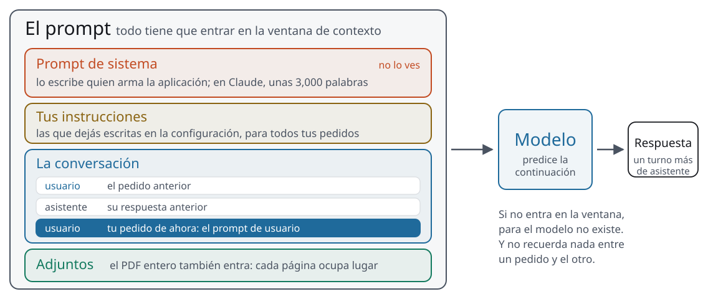

<!-- _class: portada -->

# Prompts y datos, en la práctica

Sesión 3 de 8 · día 2: datos y documentos, con el chatbot trabajando · 2 h en vivo · **PCR · CGC · Tecpetrol · Andes Petroleum**

<!--
0:00 · portada mientras entra la gente
Ventanas de hoy: A este deck; C el sitio en la página de la sesión 3; D Claude
con la ejecución de código y la creación de archivos activadas (si se puede,
una cuenta gratuita, para ver lo mismo que ellos); E la página de
Indicaciones del sistema de Claude Sonnet 5.5, en la documentación en español
(platform.claude.com/docs/es/release-notes/system-prompts/claude-sonnet-5-5); F Gemini como plan B.
En el escritorio: los seis partes de la ARCH (public/descargas/
arch-reporte-diario-2026-09-{08,09,10,11,14,15}.pdf),
campos_capiv_2006_2026.csv, campos_capiv_sucio.csv y
arch_consolidado_referencia.xlsx abierto como respuesta.
En la configuración de Claude, "Instrucciones para Claude" vacías al empezar:
se llenan en vivo en el bloque 3.
Nadie trae nada: ni tarea ni datos. Todo sale de la página.
Apoyo: cronómetro en cero, chat abierto, lista por nombre y empresa a la
vista, y el link de la página de la sesión 3 listo para pegar.
-->

---

<!-- _class: seccion -->

## Apertura

Bloque 1 de 7 · **8 min**

<!--
0 min · acumulado 0:00
Arranca 0:00, termina 0:08.
-->

---

<!-- _class: agenda -->

## Esta sesión

| Bloque | min |
| --- | --- |
| Apertura | 8 |
| Qué es un prompt | 15 |
| Un parte, cuatro correos | 25 |
| Qué hace un buen prompt | 5 |
| Prompt corto, dato bueno | 12 |
| Taller: seis partes en un Excel | 35 |
| Qué no se sube, y para llevarse | 10 |
| Pausa | 10 |

<!--
1 min · acumulado 0:01
La misma tabla está en la página de la sesión 3.
Bajada del día: ayer vimos qué es y cómo funciona; hoy lo ponemos a trabajar.
Esta mañana, prompts y datos: el chatbot escribe, lee archivos y arma una
planilla. Después de la pausa, documentos.
Apoyo: avisar por el chat privado cuando un bloque se pase cinco minutos.
-->

---

## Al final de la sesión van a poder

- Explicar qué es un prompt, y separar el **de sistema** del **de usuario**
- Escribir lo mismo para **otro destinatario y otro idioma**, y revisarlo
- **Consolidar una serie** de partes en un Excel con controles

<!--
1 min · acumulado 0:02
Decirlo en una frase: hoy aprendemos a pedir y a revisar lo que devuelve.
-->

---

<!-- _class: panel -->

## Entrá al sitio y abrí Claude

`mpodeley.github.io/curso-ia-energia`

En la página de la sesión 3: la cuenta gratuita de Claude y cómo activar la ejecución de código.

<!--
6 min · acumulado 0:08
Dos pasos, con pantalla compartida: crear la cuenta (con Google es un
minuto) y activar en la configuración la ejecución de código y la creación
de archivos.
Si el firewall de la empresa bloquea Claude: siguen desde el celular, o
hacen los correos en Gemini y miran el taller en la pantalla compartida.
Apoyo: pegar el link en el chat y confirmar por nombre, uno por uno, que
cada persona tiene Claude abierto. El que se traba, por el chat privado.
-->

---

<!-- _class: seccion -->

## Qué es un prompt

Bloque 2 de 7 · **15 min**

<!--
0 min · acumulado 0:08
Arranca 0:08, termina 0:23.
-->

---

<!-- _class: figura -->

## Todo lo que recibe el modelo en un pedido



Todo viaja junto en cada pedido: el modelo no recuerda nada entre un pedido y el otro.

<!--
4 min · acumulado 0:12
Retomar la ventana de contexto de ayer: el prompt es lo que hay en la
ventana cuando le toca responder. Recorrer las capas de arriba abajo.
La que más sorprende es la primera: hay texto que el modelo recibe antes de
tu primer mensaje, y no lo escribiste vos.
-->

---

## Prompt de sistema y prompt de usuario

- **De sistema**: lo escribe quien arma la aplicación, y vale para toda la conversación
- **De usuario**: lo que escribís en cada turno
- Por dentro son dos campos del mismo pedido: `system` y `messages`

<!--
3 min · acumulado 0:15
En la página está el ejemplo oficial de Anthropic, con el campo "system" y un
mensaje de usuario. OpenAI lo llama "instructions" o mensajes de
"developer", con prioridad sobre los del usuario; Google, "system_instruction".
El miércoles vuelve este formato: así también se le describen las
herramientas a un agente.
-->

---

## Así se ve el de Claude

```text
This iteration of Claude is Claude Sonnet 5.5.

... talking to someone from {{currentDateTime}}

... responds in prose rather than lists or bullets unless asked

Personal tone, formatting, or feature preferences go in "user preferences"
```

En la app no se ve. Anthropic publica una copia: versión del 28 de septiembre de 2026.

<!--
5 min · acumulado 0:20
Aclarar primero: dentro de Claude no se puede ver, y pedírselo al chat no da
una copia fiable. Lo que se muestra es la copia que Anthropic publica en su
documentación.
Abrir la ventana E y bajar por el texto: son varias páginas, ordenadas con
etiquetas como <product_information> y <tone_and_formatting>. Que vean el
largo.
Tres lecturas. La fecha entra por acá: {{currentDateTime}} se reemplaza en
cada conversación, y por eso sabe qué día es aunque su conocimiento termine
en junio. Si no pedís formato, responde en prosa: el formato se pide. Y los
consejos de prompting que da Claude (claro y detallado, ejemplos, formato)
son los de hoy.
ChatGPT y Gemini no publican el suyo; no mostrar versiones filtradas.
-->

---

## Dónde escribís el tuyo

- **Claude**: "Instrucciones para Claude", en la configuración
- **Gemini**: "Instrucciones para Gemini", y los Gems
- **ChatGPT**: instrucciones personalizadas

Va lo que no cambia de un pedido a otro.

<!--
3 min · acumulado 0:23
Mostrar en la ventana D dónde está la opción en Claude. Todavía no escribir
nada: se llena al final del bloque siguiente, con lo que se repita en los
cuatro correos.
Los proyectos de Claude también tienen instrucciones propias; la ayuda de
Anthropic se contradice sobre si están en la cuenta gratuita, así que el
ejercicio usa las de la configuración.
-->

---

<!-- _class: seccion -->

## Un parte, cuatro correos

Bloque 3 de 7 · **25 min**

<!--
0 min · acumulado 0:23
Arranca 0:23, termina 0:48.
-->

---

## Los datos: EP Petroecuador, 14 de septiembre

- 366,559.66 barriles por día, 1,498.70 menos que el día anterior
- Bloque 15: 59 pozos cerrados 4 horas por la generación
- Bloque 58: 5 pozos de Cuyabeno cerrados 24 horas
- Bloque 57: Dureno 01 cerrado por robo de cables
- Sacha y Yulebra con incremento de BSW

<!--
2 min · acumulado 0:25
Los datos completos, verificados contra el PDF, están en la página en un
bloque para copiar. Vienen del parte de la ARCH del 15 de septiembre, que
informa el día 14.
Solo lo de EP Petroecuador: nada propio de las empresas de la sala.
-->

---

<!-- _class: panel -->

## Primero, el pedido pelado

"Escribí un correo con esto." ¿Qué inventó para completar?

<!--
5 min · acumulado 0:30
En vivo en la ventana D, a la par. Que peguen los datos con esa sola línea.
Lo que suele inventar: un destinatario, un tono, un saludo largo, una
conclusión que no estaba en los datos ("la producción se mantiene estable").
Apoyo: pedir que dos personas peguen en el chat lo que inventó su correo.
-->

---

## Cuatro destinatarios, el mismo contenido

- La **gerencia**, en español: cinco líneas, en el celular
- Un **socio**, en inglés: formal
- El **grupo del equipo**: tres líneas de chat
- Un **idioma que no leés**: portugués o chino

<!--
10 min · acumulado 0:40
El pedido completo del primero está en la página: destinatario, dónde lo
lee, largo, orden, tono y "no agregues cifras ni causas que no estén en los
datos". Los otros tres cambian solo destinatario e idioma.
Cada uno elige dos de los cuatro. Mostrar en la D el de la gerencia y el
del idioma que no leemos.
Apoyo: juntar en el chat qué cambió entre el pedido pelado y el completo.
-->

---

<!-- _class: panel -->

## Lo estable, a tus instrucciones

Lo que se repitió en los cuatro pedidos va en "Instrucciones para Claude". En el pedido queda solo lo del día.

<!--
5 min · acumulado 0:45
En vivo: escribir en la configuración el tono, la regla de no agregar cifras
ni causas, y la firma. Después, el pedido corto: los datos y "para el socio,
en inglés". Comparar con el resultado sin instrucciones.
Esto es un prompt de sistema escrito por el usuario. Es la misma idea que
la pantalla anterior, del lado de ellos.
Al terminar el ejercicio, borrar las instrucciones o dejarlas: que decida
cada uno.
-->

---

## Un idioma que no leés

- Errores graves: **negación invertida**, **números o unidades cambiados**, contenido que no estaba
- Traducir de vuelta ayuda a cazarlos, en una conversación nueva
- Una vuelta limpia **no prueba** que la ida esté bien

Lo que sale de la empresa en otro idioma lo revisa alguien que lo lee.

<!--
3 min · acumulado 0:48
Fuentes en la página: la nota de transparencia de Microsoft Translator (los
errores graves) y un estudio de 2005 sobre traducción de ida y vuelta.
Anthropic recomienda nombrar el idioma de destino, idealmente en el prompt
de sistema.
Preguntar en el chat: ¿quién tiene en la empresa a alguien que lea chino o
portugués? Esa es la verificación.
-->

---

<!-- _class: seccion -->

## Qué hace un buen prompt

Bloque 4 de 7 · **5 min**

<!--
0 min · acumulado 0:48
Arranca 0:48, termina 0:53.
-->

---

<!-- _class: cita -->

## Mostrale tu prompt a un colega que no conozca la tarea: **si él se confunde, el modelo también**

<!--
2 min · acumulado 0:50
La regla de oro de la guía de prompting de Anthropic. Y su imagen: el
modelo es un empleado brillante pero nuevo, que no conoce tus normas ni tu
forma de trabajar.
-->

---

<!-- _class: acentos -->

## Las piezas que acabás de usar

- **La tarea**, con un verbo concreto
- **El destinatario y el propósito**
- **El contexto** que el modelo no tiene
- **El formato**: largo, orden, idioma
- **Ejemplos**, y qué no hacer

<!--
3 min · acumulado 0:53
Decirlas sobre el correo: cada una estuvo en el pedido completo. Google lo
dice sin vueltas: los prompts sin ejemplos suelen ser menos efectivos.
Y una que no es de manual pero rinde siempre: "decime qué supusiste".
El constructor de prompts está en la página, para practicar.
-->

---

<!-- _class: seccion -->

## Prompt corto, dato bueno

Bloque 5 de 7 · **12 min**

<!--
0 min · acumulado 0:53
Arranca 0:53, termina 1:05.
-->

---

<!-- _class: panel -->

## ¿Qué campos tengo que mirar este mes y por qué?

Una línea, con `campos_capiv_2006_2026.csv` adjunto. Nada más.

<!--
6 min · acumulado 0:59
En vivo en la D: adjuntar el archivo de siete campos argentinos del
Capítulo IV y pegar la pregunta tal cual. Mientras corre, mostrar que
escribe código y lo ejecuta.
Lo que suele encontrar: El Trapial, con lo convencional casi apagado en
2026 y Vaca Muerta creciendo; Puesto Hernández, con la relación
agua-petróleo más alta; El Corcobo Norte sin enero de 2019.
El punto: sin rol ni contexto, y la respuesta fue buena, porque el archivo
tiene columnas con nombre y unidad.
-->

---

<!-- _class: panel -->

## El mismo dato, exportado sin cuidado

`campos_capiv_sucio.csv`, en la página. La misma pregunta. ¿Qué supuso?

<!--
6 min · acumulado 1:05
Mismos números: encabezados sin unidades, coma decimal, convencional y no
convencional sumados, fechas en dos formatos, el agua de Los Perales en
barriles, ocho meses borrados y un mes duplicado.
Lo típico: Los Perales aparece como el peor campo por el agua en barriles.
Preguntarle qué supuso de las unidades.
La planilla de surveillance con relación agua-petróleo contra acumulada
quedó en la página como "para curiosos", con su referencia.
-->

---

<!-- _class: seccion -->

## Taller: seis partes en un Excel

Bloque 6 de 7 · **35 min**

<!--
0 min · acumulado 1:05
Arranca 1:05, termina 1:40.
-->

---

## Seis partes, una serie

- Los partes de la ARCH del **8 al 15 de septiembre**: seis PDF de una página
- Cada parte informa el día de operación anterior
- Juntos, dejan ver lo que un parte suelto no muestra

<!--
3 min · acumulado 1:08
Los seis están en la página, en fila. Que los bajen todos.
Preguntar antes de empezar: ¿qué días de operación cubren? La respuesta
correcta no son seis días seguidos.
-->

---

<!-- _class: panel -->

## Tu Excel, en Claude

El pedido está en la página. Los seis PDF adjuntos, y cuando baje el Excel, abrilo.

<!--
18 min · acumulado 1:26
El pedido de la página es el contrato: una hoja por tabla, un resumen con
fórmulas y gráfico, una hoja de control (sumas contra el total del parte, y
"producción anterior" contra el parte previo cuando los días son seguidos),
todo a punto decimal. El mismo contrato lo implementa
scripts/arch_consolidar.py, que armó la planilla de referencia.
Correrlo en vivo a la par. Tarda unos minutos: mientras, mostrar el código
que escribe para leer los PDF.
Plan B si se agota la cuota de alguien: sigue en Gemini, o baja
arch_consolidado_referencia.xlsx de la página.
Apoyo: a los 10 minutos, ronda rápida por el chat: ¿quién tiene el Excel
abierto? A los que no, el link de la referencia.
-->

---

## Tres chequeos

1. **¿Qué días cubre?** El fin de semana no hubo parte
2. **¿Cierra el Resumen?** Calculado contra el total del parte, con fórmula
3. **¿Por qué cae el 7?** Buscalo en las novedades

<!--
6 min · acumulado 1:32
Apoyo: ronda con nombre, uno por empresa: ¿qué chequeo falló?
Si el Resumen trae números pegados, pedirle que lo rehaga con fórmulas.
-->

---

## Lo que tiene que dar

| Día de operación | EP Petroecuador | Total nacional |
| --- | --- | --- |
| 7 de septiembre | 346,742.97 | 443,711.91 |
| 8 de septiembre | 360,858.53 | 457,624.54 |
| 9 de septiembre | 361,238.63 | 457,670.12 |
| 10 de septiembre | 366,095.21 | 463,100.10 |
| 13 de septiembre | 368,058.36 | 465,110.65 |
| 14 de septiembre | 366,559.66 | 463,812.77 |

<!--
3 min · acumulado 1:35
Barriles por día. Las privadas y el resto, en la página y en la referencia.
Las compañías suman el total de cada parte, al centavo.
-->

---

## Lo que cuenta la serie

- **El 7 cae al 95.98% del estimado**: 163 pozos del bloque 43 cerrados por una falla de seguridad
- **El parte del 11 corrige el 9**: EP Petroecuador pasa de 361,238.63 a 367,065.88
- **Faltan el 11 y el 12**: del 12 queda solo la "producción anterior" del parte del 14

<!--
3 min · acumulado 1:38
La corrección del día 9 son 5,827 barriles por día, 1.6%. Los otros días,
dos barriles. Los volúmenes son preliminares: al armar una serie, elegir una
columna y anotarlo.
El gas cambia de formato: cinco días con coma decimal, el 15 con punto.
-->

---

## Mañana, un agente

Bajar el PDF nuevo, leerlo, sumar, controlar contra el día anterior y avisar si algo no cuadra. Todos los días.

Hoy lo hiciste con el chatbot. Mañana lo hace un agente, y vemos dónde hay que mirarlo.

<!--
2 min · acumulado 1:40
La dirección de cada parte tiene siempre la misma forma: por eso se puede
bajar solo. Mañana, en la sesión 5, un agente de terminal trabaja sobre esta
misma carpeta de partes.
-->

---

<!-- _class: seccion -->

## Qué no se sube, y para llevarse

Bloque 7 de 7 · **10 min**

<!--
0 min · acumulado 1:40
Arranca 1:40, termina 1:50.
-->

---

<!-- _class: cita -->

## Si no lo pondrías en un correo a un desconocido, **no va en el chat**

<!--
4 min · acumulado 1:44
Todo lo de hoy fue público. En la sala hay cuatro empresas que compiten, y el
chat de la videollamada es tan compartido como el chatbot: ningún ejercicio
pide un dato de la empresa. Para practicar con una estructura real: datos
públicos, datos viejos, o la misma planilla con números inventados. Los casos
grises y las versiones corporativas, en la sesión 7.
-->

---

<!-- _class: acentos -->

## Qué te llevás de esta sesión

- **Lo que se repite**, en tus instrucciones; lo del día, en el pedido
- **Verificá cada número** contra la fuente, y otro idioma con quien lo lee
- **Pedí fórmulas y una hoja de control** en la planilla que vas a reusar

<!--
6 min · acumulado 1:50
Decirlas en palabras propias, sin leer. Si sobra un minuto, preguntar quién
escribió algo en sus instrucciones y lo va a dejar.
Apoyo: la hora de vuelta en el chat.
-->

---

## Pausa · 10 min

A las 12:00 (10:00 en Ecuador y Colombia) sigue la **sesión 4**: tus documentos, con Gemini Notebook. Dejá abierta la página de la sesión 4.

<!--
10 min · acumulado 2:00
Cerrar este deck y abrir el de la sesión 4. Ventana nueva con Gemini
Notebook y el cuaderno de reservas y normativa ya armado.
-->
