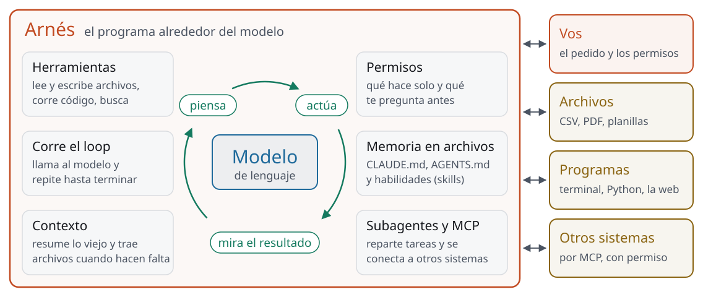

<!-- _class: portada -->

# Agentes: qué son, el arnés y cuáles hay

Sesión 5 de 8 · día 3: agentes · 2 h en vivo · **PCR · CGC · Tecpetrol · Andes Petroleum**

<!--
0:00 · portada mientras entra la gente
Ventanas de hoy: A este deck; C el sitio en la página de la sesión 5; D
Claude con la ejecución de código y la creación de archivos activadas (si se
puede, una cuenta gratuita, la misma herramienta del taller); E Arena en modo
agente (arena.ai/agent) con la sesión ya iniciada; F el agente de
investigación de una cuenta paga del curso (Claude Research o Gemini Deep
Research, el que esté ensayado); G la terminal con el agente sobre una
carpeta de prueba (Claude Code), la misma que se usa en la sesión 6.
En el escritorio: public/descargas/campos_capiv_2006_2026.csv y
campos_capiv_sucio.csv, y la carpeta de prueba con esos dos CSV y los dos PDF
de Ecuador de ayer.
Nadie trae nada: ni tarea ni datos. Todo sale de la página.
Apoyo: cronómetro en cero, chat abierto, lista por nombre y empresa a la
vista, y el link de la página de la sesión 5 listo para pegar.
-->

---

<!-- _class: seccion -->

## Apertura

Bloque 1 de 6 · **8 min**

<!--
0 min · acumulado 0:00
Arranca 0:00, termina 0:08.
-->

---

<!-- _class: agenda -->

## Esta sesión

| Bloque | Tiempo | Qué hacemos |
| --- | --- | --- |
| Apertura | 8 min | De ayer a hoy: el chatbot que corrió código ya era un agente chico |
| Qué es un agente | 15 min | Modelo, herramientas y loop; la traza del ejercicio paso a paso |
| El arnés | 20 min | Qué es, qué hace y cuánto pesa en el resultado |
| Qué agentes hay, y cómo se usan | 25 min | El mapa por forma de uso, lo que es gratis, y tres en vivo |
| Taller: tu primer agente | 30 min | Cada uno corre un agente gratuito sobre una tarea dada y verifica dos cosas del resultado |
| Qué delegar, y para llevarse | 12 min | Digital, acotado y verificable; lo irreversible queda afuera; tres prácticas |
| Pausa | 10 min | A las 12:00 (10:00 en Ecuador y Colombia) sigue la sesión 6 |

<!--
1 min · acumulado 0:01
La misma tabla está en la página de la sesión 5.
Bajada del día: hoy es el día de los agentes. Esta mañana, qué son, qué los
rodea y cuáles hay, con un taller para correr uno gratis. Después de la
pausa, en la sesión 6, un agente arma en vivo el caso real del curso.
Apoyo: avisar por el chat privado cuando un bloque se pase cinco minutos.
-->

---

## Al final de la sesión van a poder

- Explicar qué es un **agente** y qué hace el **arnés** que lo envuelve
- Ubicar los agentes de hoy **por forma de uso**, y cuáles se prueban gratis
- Correr uno sobre una tarea de varios pasos y **verificar lo que entregó**

<!--
1 min · acumulado 0:02
Decirlo en una frase: hoy le ponemos nombre a algo que ya usaron ayer.
-->

---

## Ayer ya usaron un agente chico

Le pidieron una planilla. Claude leyó el archivo, escribió un programa, lo corrió, **miró el resultado**, corrigió y armó el Excel.

Eso es un agente: un modelo que usa herramientas y ve lo que sale.

<!--
4 min · acumulado 0:06
Antes de mostrar el segundo párrafo, pregunta por voz a dos o tres
personas: ¿qué hizo Claude entre que subieron el archivo y bajaron el
Excel? Queremos oír "escribió código", "lo corrió", "tardó", "se corrigió".
Si alguien desplegó un bloque de código ayer, que cuente qué vio.
El remate es la segunda línea: eso ya era un agente, con pocas
herramientas y en una computadora aislada. Hoy le ponemos nombre a cada
pieza.
Apoyo: llama por nombre, uno de cada empresa si se puede.
-->

---

<!-- _class: panel -->

## Entrá al sitio y abrí Claude

`mpodeley.github.io/curso-ia-energia`

En la página de la sesión 5 están la traza del agente, el mapa de agentes y el taller, con el archivo de ayer.

<!--
2 min · acumulado 0:08
Que abran la página de la sesión 5 y, en otra pestaña, Claude como ayer.
El que no tenga el archivo lo baja desde la página: es el mismo de ayer.
Plan B si el firewall de la empresa bloquea Claude o Arena: siguen desde el
celular con datos móviles, o miran la pantalla compartida y en el taller
hacen la alternativa en Gemini, que suele pasar los filtros corporativos.
Apoyo: pegar el link en el chat y confirmar por nombre que cada uno tiene
la página abierta.
-->

---

<!-- _class: seccion -->

## Qué es un agente

Bloque 2 de 6 · **15 min**

<!--
0 min · acumulado 0:08
Arranca 0:08, termina 0:23.
-->

---

## Un modelo en un loop, con herramientas

**Piensa** qué le falta, **ejecuta** una herramienta, mira el resultado y vuelve a pensar, hasta que puede responder.

Un chatbot sin herramientas no se entera de su error. Un agente lo recibe de vuelta.

<!--
3 min · acumulado 0:11
La definición de Anthropic (Building effective agents, diciembre de 2024),
en una línea: modelos que usan herramientas según lo que les devuelve el
entorno, en un loop. Está en la página, con el link.
Debajo está el mismo modelo de la sesión 2, el que predice el próximo
token. Lo nuevo son dos cosas: ejecutar y mirar lo que salió.
Gancho del rubro: un pozo con un sensor que manda datos es la misma idea.
Sin retorno, operás a ciegas; con retorno, corregís.
-->

---

<!-- _class: panel -->

## La traza, paso a paso

Ejercicio "El loop por dentro", en la página: una corrida sobre el Capítulo IV, en diez pasos. Frenamos en el **tercero**.

<!--
9 min · acumulado 0:20
Ventana C, ejercicio "El loop por dentro". Recorrerlo juntos, paso a paso,
leyendo en voz alta qué piensa, qué herramienta llama y qué vuelve.
Pasos 1 y 2: antes de escribir código, mira qué hay. Primer hábito bueno.
Paso 3: filtra por AGUARAGUE sin diéresis y le vuelven cero filas. Frenar
acá. Pregunta al chat, una línea por persona: ¿qué hace ahora el agente?
Apoyo: lee las respuestas en voz alta a medida que llegan.
Paso 4: lista los valores que existen, encuentra la diéresis, corrige y
sigue. Las cero filas le sirvieron de información, y las usa porque VE el
resultado.
Paso 10: la respuesta trae dos advertencias sobre lo que no verificó.
Mostrar el contador de contexto: crece en cada vuelta. Vuelve en el
bloque 6.
-->

---

## Flujo fijo o agente

- **Flujo fijo**: una persona escribió los pasos de antemano; el modelo cumple su parte en cada uno
- **Agente**: el modelo decide el paso siguiente según lo que va viendo

Los dos sirven. Empezá por lo más simple que resuelva el problema.

<!--
3 min · acumulado 0:23
La distinción es de la misma nota de Anthropic. Sirve para leer anuncios:
mucho de lo que se vende como agente es un flujo fijo con un modelo
adentro, y eso está bien. La vamos a usar en el bloque 4 con un anuncio del
rubro.
Cierre del bloque 2.
-->

---

<!-- _class: seccion -->

## El arnés

Bloque 3 de 6 · **20 min**

<!--
0 min · acumulado 0:23
Arranca 0:23, termina 0:43.
-->

---

<!-- _class: figura -->

## El arnés, todo lo que rodea al modelo

El modelo recibe y devuelve texto. Todo lo demás lo hace el arnés (en inglés, harness).

<!--
5 min · acumulado 0:28
Recorrer la figura de adentro hacia afuera, con el dedo.
Centro: el modelo. Solo recibe texto y devuelve texto.
El loop verde: piensa, actúa, mira el resultado. Es la traza de recién.
El recuadro naranja es el arnés: el programa que corre el loop y ejecuta
las herramientas. El modelo pide "corré este código"; el que lo corre es
el arnés.
Afuera: vos, que pedís y das permisos; tus archivos; los programas; otros
sistemas. Todo eso lo toca el arnés, nunca el modelo directo.
En inglés también se dice scaffold, andamio. Epoch AI lo describe como el
software que opera al agente, en general un programa de terminal.
-->

---

## Seis cosas que hace el arnés

- Le da **herramientas**: archivos, código, búsqueda, navegador
- Corre el **loop** hasta que la tarea termina
- Decide qué entra al **contexto**: resume lo viejo y trae lo justo
- Pide **permiso** antes de lo que no puede hacer solo
- Guarda la **memoria en archivos**: CLAUDE.md, AGENTS.md, skills
- **Reparte y conecta**: subagentes, y otros sistemas por MCP

<!--
4 min · acumulado 0:32
Pasar las seis con el Claude de ayer como ejemplo, rápido:
herramientas, código en una computadora aislada y archivos; loop, sí, cada
bloque de código que desplegaron era una vuelta; contexto, hasta 20
archivos por conversación; permisos, casi no pide porque trabaja aislado y
no toca nada de tu computadora; memoria, el modelo no recuerda nada, lo
que sepa de vos se lo pasa el arnés; conectores, uno propio en la cuenta
gratuita.
MCP: protocolo de contexto de modelo, un estándar abierto de Anthropic
para conectar herramientas y datos. Un enchufe común. El callout de la
página lo dice en tres líneas; no profundizar.
-->

---

## Trabaja por turnos, y deja un parte

Cada sesión de un agente arranca **sin memoria** de la anterior, como un turno nuevo.

El arnés le hace leer y escribir un parte: instrucciones, avance, lo que falta. A un agente se le enseña **por escrito**.

<!--
3 min · acumulado 0:35
La imagen es de Anthropic (Effective harnesses for long-running agents,
noviembre de 2025): un proyecto atendido por ingenieros que trabajan por
turnos, y cada uno llega sin memoria del turno anterior. En un yacimiento
se entiende sola.
Su solución es la de una guardia bien llevada: un parte de avance que el
agente escribe al terminar y lee al empezar, la lista de lo que falta, el
historial de cambios.
El punto práctico: las reglas de la tarea van en un archivo (CLAUDE.md,
AGENTS.md), y ese archivo sobrevive al cambio de modelo. En la sesión 6 lo
ven funcionando sobre una carpeta.
-->

---

## ¿Cuánto pesa el arnés en el resultado?

- **Epoch AI**, diciembre de 2025: mismo modelo, otro arnés, hasta 11% y 15% de diferencia en un examen de programación
- **METR**, febrero de 2026: Claude Code y Codex contra arneses simples, sin una gran diferencia en el largo de tarea

El arnés decide sobre todo **qué puede hacer** el agente.

<!--
3 min · acumulado 0:38
Epoch AI: SWE-bench Verified, tareas reales de programación. Cambiar solo
el arnés movió hasta 11% el resultado de GPT-5 y hasta 15% el de Kimi K2
Thinking.
METR: midió si Claude Code y Codex alargaban las tareas que el modelo
completa solo, contra sus arneses de prueba. Concluyó que no hacen una gran
diferencia.
Lectura para ellos: el arnés abre y cierra puertas (herramientas,
permisos, memoria); la capacidad de fondo la pone el modelo. El mismo
modelo hace cosas distintas en dos productos distintos: el Claude de ayer y
el Claude Code de la sesión 6.
-->

---

<!-- _class: panel -->

## Una herramienta sí, una no

Pensá en tu trabajo: ¿qué herramienta le darías a un agente, y cuál **no** le darías?

<!--
5 min · acumulado 0:43
Ronda por nombre, seis personas, cuarenta segundos cada una. Solo el tipo
de herramienta, nunca el sistema ni el dato de la empresa: "leer la
carpeta de informes, sí; mandar correos, no".
Escuchar el patrón: lo que dan es de lectura; lo que no dan escribe, manda
o mueve algo. Nombrarlo sin cerrarlo: vuelve en el bloque 6.
Apoyo: anota la columna del "no" en su documento; es material del bloque 6
y de la sesión 7.
Cierre del bloque 3.
-->

---

<!-- _class: seccion -->

## Qué agentes hay, y cómo se usan

Bloque 4 de 6 · **25 min**

<!--
0 min · acumulado 0:43
Arranca 0:43, termina 1:08.
-->

---

<!-- _class: panel -->

## Un agente de investigación, lanzado ahora

Le damos una pregunta del rubro y lo dejamos trabajar. Volvemos a verlo al final del bloque.

<!--
1 min · acumulado 0:44
Ventana F. Pregunta: "¿Qué yacimientos de Argentina anunciaron o
iniciaron proyectos de recuperación secundaria o terciaria desde 2024?
Tabla con yacimiento, operadora, cuenca, etapa y la fuente de cada dato
con su enlace."
Mostrar el plan que propone, aprobarlo y dejarlo correr: tarda entre
cinco y diez minutos.
Plan B si no arranca o la cuenta está sin cupo: se sigue, y al final del
bloque se abren dos citas de un informe ya corrido antes de clase.
-->

---

## Seis formas de usar un agente

- **Chat con herramientas**: corre código sobre tus archivos
- **Investigación**: lee decenas de páginas y te da un informe con fuentes
- **Navegador y computadora**: usa sitios y aplicaciones como vos
- **Terminal sobre una carpeta**: lee, escribe y ejecuta en tus archivos
- **Conectores**: lo enchufan a tus sistemas por MCP
- **Caja de arena**: una computadora descartable en la nube

<!--
3 min · acumulado 0:47
El orden es por forma de uso, que es lo que dura; las marcas cambian de un
mes a otro.
Ayer usaron la primera. Hoy vemos en vivo la segunda, la cuarta y la
sexta. La tercera es la que más cerca está de tocar sistemas: sitios con tu
sesión iniciada. Mencionarlo sin alarma; es la puerta a la sesión 7.
-->

---

## Gratis, al 28 de septiembre

| Forma | Gratis | Pago o empresa |
| --- | --- | --- |
| Chat con herramientas | Claude, Gemini, ChatGPT (con límites) | Los mismos, con más cuota |
| Investigación | Gemini Deep Research, ChatGPT (pocas) | Claude Research |
| Navegador | ChatGPT Work, app de escritorio | Claude in Chrome, Copilot Autopilot |
| Terminal | Codex (tareas cortas), Antigravity | Claude Code |
| Conectores | Claude, un conector propio | Más conectores |
| Caja de arena | Arena, modo agente | |

<!--
3 min · acumulado 0:50
La tabla completa, con un link por dato, está en la página. Envejece
rápido: decirlo.
Detalles por si preguntan: Gemini Deep Research es gratis pero puede no
estar disponible en horas pico (ayuda de Google). ChatGPT Work y Codex
comparten cuota, también en la cuenta gratuita, desde la app de
escritorio. Claude in Chrome está en todos los planes pagos desde el 26 de
agosto de 2026. Microsoft anunció Autopilot el 25 de septiembre de 2026, en
vista previa privada. Antigravity reemplazó a Gemini CLI en las cuentas sin
pago el 18 de junio de 2026, con cuota semanal.
Para el taller alcanzan dos: Claude y Arena.
-->

---

<!-- _class: panel -->

## En vivo: un agente en una caja de arena

Arena, modo agente, con el **archivo sucio** de ayer. Miren qué lee primero y qué hace cuando algo no cierra.

<!--
7 min · acumulado 0:57
Ventana E. Adjuntar campos_capiv_sucio.csv con: "Limpiá este archivo y
contame qué encontraste: separador, formato de números y de fechas, meses
que falten o se repitan. Entregame el archivo limpio en CSV."
Narrar el loop mientras corre: qué comando usa, qué vuelve, qué decide con
eso. Mostrar el panel del espacio de trabajo y la descarga en zip.
Contrastar con la lista de la página de la sesión 3 (sin ensayar: lo que
sigue es lo esperable). El separador, la coma decimal, las dos fechas y el
mes duplicado de Diadema se ven al leer el archivo. El agua de Los Perales
en barriles y lo convencional sumado con lo no convencional no vuelven como
error, así que lo probable es que pasen. Si pasan, ese es el límite del
loop: se corrige lo que el agente ve.
Recordar la regla de Arena: puede compartir la conversación con los
proveedores de los modelos. Solo dato público.
Plan B si Arena no responde o pide cuenta: la misma demo en Claude,
ventana D.
-->

---

<!-- _class: panel -->

## En vivo: un agente sobre una carpeta

Un agente de terminal, en una carpeta con los archivos de ayer. Miren **cuándo pide permiso**.

<!--
4 min · acumulado 1:01
Ventana G. Pedido: "¿Qué hay en esta carpeta? Armá un resumen de una
página de lo que trae cada archivo y guardalo como resumen.md."
Mostrar: lista la carpeta, lee, y antes de escribir el archivo pide
permiso. Esa pregunta es el arnés, la función de permisos de la figura.
Es un adelanto, no más: en la sesión 6 este mismo agente arma el caso de
waterflooding. No profundizar acá.
Plan B si la terminal falla: contarlo con la figura del arnés y seguir.
-->

---

## En la industria: Leucipa

Baker Hughes y Expand Energy, enero de 2026: **miles de pozos de gas** en Marcellus, Utica y Haynesville, con flujos de trabajo con IA y un asistente conversacional.

El comunicado no usa la palabra agente.

<!--
2 min · acumulado 1:03
Comunicado del 29 de enero de 2026, link en la página. Leucipa es la
solución de producción automatizada de Baker Hughes; Lucy, un asistente
conversacional sobre los datos de producción, entra como piloto.
Leerlo con la distinción del bloque 2: lo que describe se parece más a un
flujo fijo con modelos adentro, pensado para repetirse en miles de pozos,
que a un agente que decide solo sus pasos. Decirlo con honestidad: no
sabemos más que lo que dice el comunicado.
-->

---

<!-- _class: panel -->

## Volvamos al de investigación

Abrimos **dos citas** del informe, en vivo. ¿Dicen lo que el informe dice que dicen?

<!--
5 min · acumulado 1:08
Ventana F. Mostrar el informe y abrir dos enlaces al azar. Por cada uno:
¿la página existe? ¿dice lo que dice la tabla (yacimiento, operadora,
fecha)? ¿es fuente oficial o prensa?
Es el mismo chequeo que van a hacer en la alternativa del taller.
Plan B si el informe no terminó: mostrar el plan y las fuentes que está
leyendo, y volver a abrirlo al final del taller.
Cierre del bloque 4.
-->

---

<!-- _class: seccion -->

## Taller: tu primer agente

Bloque 5 de 6 · **30 min**

<!--
0 min · acumulado 1:08
Arranca 1:08, termina 1:38.
-->

---

## La tarea: siete campos, seis pasos

1. Revisar el archivo y quedarse con lo convencional
2. Np y relación agua-petróleo (RAP) de 2020 y 2025, por campo
3. Marcar los campos con RAP de 2025 mayor que 30
4. Un gráfico de la RAP anual, en escala logarítmica
5. Una nota de una página para el gerente de producción
6. Tres archivos: planilla, gráfico y nota

<!--
3 min · acumulado 1:11
El pedido completo está en la página, listo para copiar. Claude como ayer,
o Arena en modo agente. Alternativa para el que prefiera: Gemini Deep
Research sobre proyectos de recuperación secundaria en Ecuador de 2024 a
2026; también está en la página, con sus dos chequeos.
Lo que tienen que mirar mientras corre: qué herramienta usa en cada paso y
qué hace cuando algo no le da.
-->

---

<!-- _class: panel -->

## A trabajar

El pedido está en la página. Claude o Arena, con el archivo de ayer. Mientras corre, **mirá el loop**.

<!--
17 min · acumulado 1:28
Correrlo en vivo a la par en la ventana D, sin proyectar hasta que ellos
tengan el suyo.
Apoyo: a los 8 minutos, ronda por el chat: ¿quién ya tiene los tres
archivos? Al que no, ayuda por el chat privado.
Plan B, en orden:
Se agotó la cuota gratuita de Claude: el mismo pedido en Arena, o la
alternativa en Gemini. La cuota de Claude se renueva cada cinco horas.
Arena pide cuenta: entrar con Google, o seguir en Claude.
El firewall de la empresa bloquea Claude o Arena: el celular con datos
móviles, o la pantalla compartida y los dos chequeos sobre la tabla de
referencia de la página.
Si el agente se traba en el paso 6 (los tres archivos), alcanza con la
planilla: los chequeos se hacen igual.
-->

---

## Dos chequeos antes de creerle

1. **Np de El Corcobo Norte**: 15,109,737 m³, el mismo de la planilla de ayer
2. **RAP de El Trapial en 2025**: 4,178,451 / 71,639 = 58.33

Marcados: Chihuido de la Sierra Negra, El Trapial y Puesto Hernández.

<!--
4 min · acumulado 1:32
Que cada uno busque los dos números en su planilla y en su nota. Si no
coinciden, que le pregunten al agente de dónde sacó el suyo: es la mejor
manera de ver en qué supuesto se desvió (casi siempre, no filtró lo
convencional o sumó mal el año).
Diadema da 28.08: cerca del umbral y subiendo. Una buena nota lo menciona.
Para la alternativa: dos citas abiertas; fuente oficial o prensa; la fecha
dentro de 2024 a 2026.
-->

---

<!-- _class: panel -->

## Ronda: qué hizo tu agente

Una cosa que hizo sin que se la pidieras, y **qué chequeo pasó o falló**.

<!--
6 min · acumulado 1:38
Ronda por nombre, un minuto por persona. Buscar dos tipos de respuesta:
el agente que se corrigió solo (la diéresis de la traza, en versión
propia) y el que entregó algo prolijo con un número mal. Los dos enseñan
lo mismo: lo que vuelve como error se corrige; lo que no vuelve, lo
atrapan los chequeos.
Apoyo: llama el orden y anota qué chequeo falló en cada caso.
Cierre del bloque 5.
-->

---

<!-- _class: seccion -->

## Qué delegar, y para llevarse

Bloque 6 de 6 · **12 min**

<!--
0 min · acumulado 1:38
Arranca 1:38, termina 1:50.
-->

---

## Qué se delega hoy

Lo **digital, acotado y verificable**: el resultado se comprueba rápido, como con los dos chequeos del taller.

Acotado quiere decir corto: el contexto crece en cada vuelta. El techo igual sube cada pocos meses.

<!--
4 min · acumulado 1:42
Ejemplos: buscar en muchos documentos, pasar datos de un formato a otro,
escribir y corregir código, automatizar pasos que hoy hacen a mano.
Una tarea de veinte pasos suele salir peor que dos de diez: el contador de
la traza.
El techo: METR mide el largo de tarea que un agente completa solo. En mayo
de 2026 ubicó una versión temprana de Claude Mythos Preview por encima de
16 horas, el máximo que su conjunto de tareas mide bien; con 50% de éxito
y en tareas de software. Lo que hoy no delegan por largo, que lo vuelvan a
probar en unos meses.
-->

---

<!-- _class: cita -->

## Lo que no se deshace **lo aprueba una persona**

<!--
3 min · acumulado 1:45
Todo lo que hicieron hoy los agentes se deshace: leyeron archivos y
escribieron otros. Cuando la herramienta manda un correo, carga una
nominación o escribe en un sistema de control, el paso equivocado ya quedó
hecho y mirar la salida llega tarde.
Traer la columna del "no" de la ronda del bloque 3: casi todo lo que
pusieron ahí es de este tipo. Eso es la sesión 7.
-->

---

<!-- _class: acentos -->

## Para llevarse

- **Mirá el arnés**: qué herramientas y permisos tiene el agente decide qué puede hacer
- **Delegá lo digital, acotado y verificable**; lo que no se deshace, lo aprueba una persona
- **Dos chequeos** antes de usar lo que entregó: una cuenta contra el archivo y una cita abierta

<!--
3 min · acumulado 1:48
Decirlas en palabras propias, sin leer. Son las tres de la página.
El quiz de la sesión 5 y la traza quedan en la página.
-->

---

## Después de la pausa, la sesión 6

- Un agente de terminal arma **en vivo** el caso real del curso: un screening de waterflooding
- Cada empresa escribe **su caso** en una página

<!--
2 min · acumulado 1:50
Adelanto de treinta segundos por punto. El agente de la sesión 6 es el de
la carpeta de recién, guiado por un archivo de instrucciones.
Apoyo: la hora de vuelta en el chat.
Cierre del bloque 6.
-->

---

<!-- _class: seccion -->

## Pausa · 10 min

A las 12:00 (10:00 en Ecuador y Colombia) sigue la **sesión 6**, con su propio deck. Dejá abierta la página de la sesión 6.

<!--
10 min · acumulado 2:00
Cerrar este deck y abrir el de la sesión 6. Dejar lista la terminal del
agente sobre la carpeta del caso.
Apoyo: cronómetro de diez minutos a la vista y aviso a los dos minutos del
final; pegar en el chat el link de la página de la sesión 6.
-->
