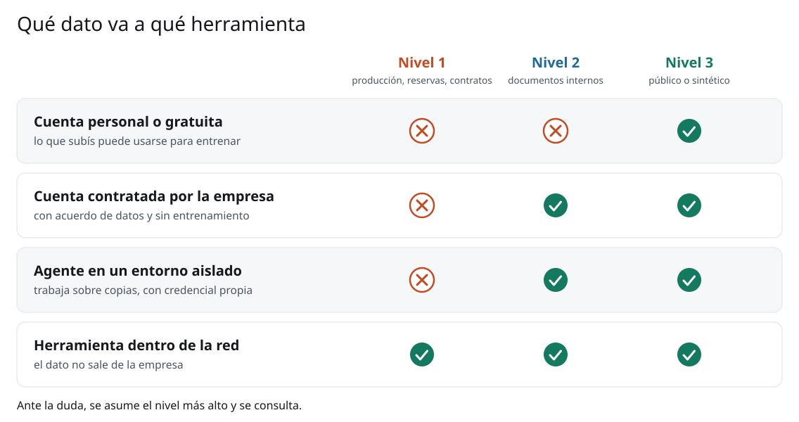
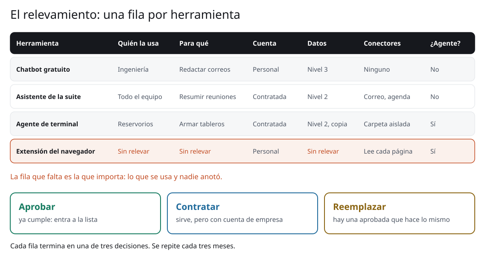
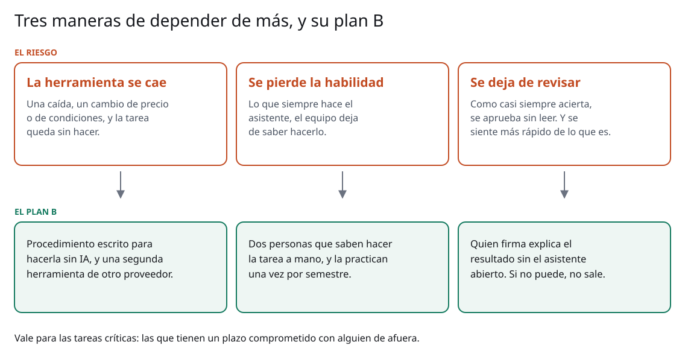
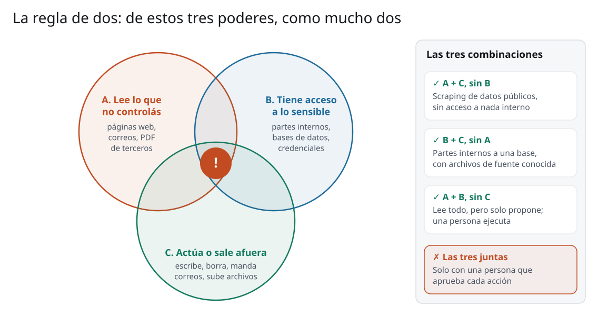
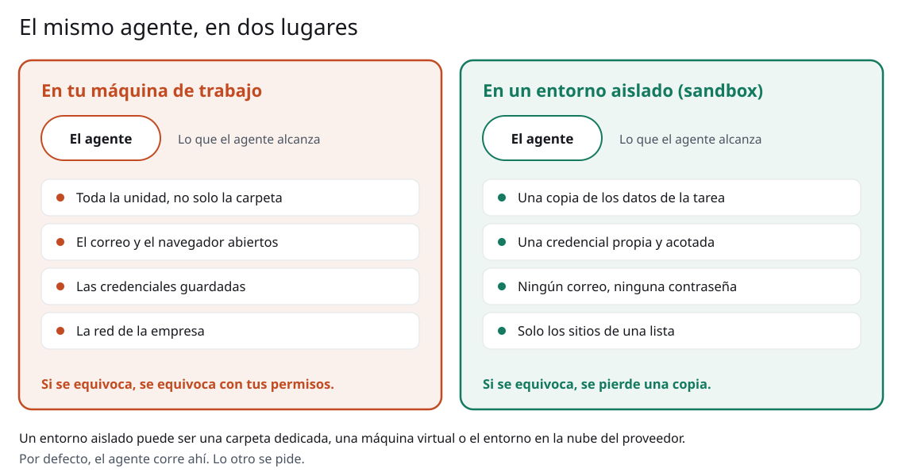
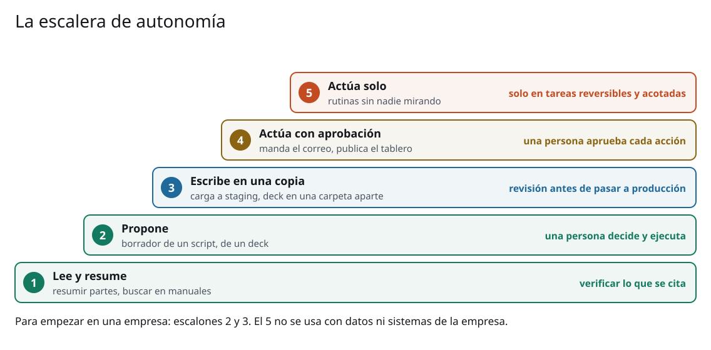
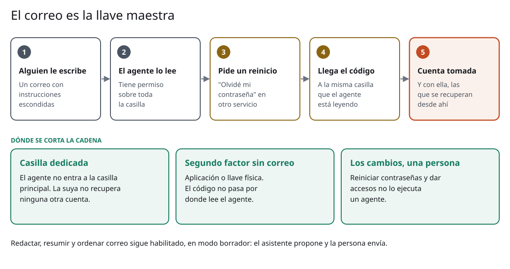
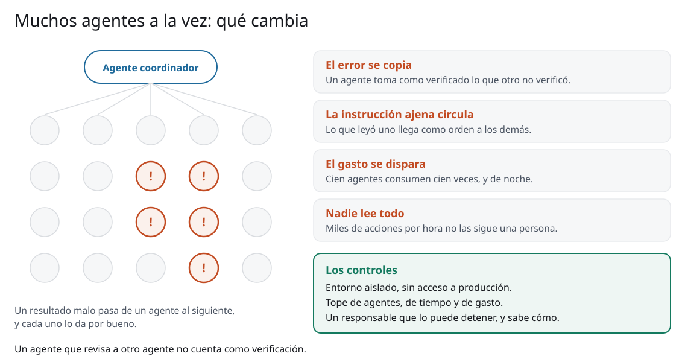

<!-- _class: portada -->

# Información, riesgos y política de uso

Sesión 7 de 8 · día 4: riesgos y el caso real · 2 h en vivo · **PCR · CGC · Tecpetrol · Andes Petroleum**

<!--
0:00 · portada mientras entra la gente
Ventanas de esta sesión: A este deck, C el sitio en la página de la sesión 7.
Antes de clase: la política larga (politica-uso-ia.docx, la versión 1.0)
abierta en el índice, y la de una página al lado. El video de Hugging Face
(Televisión Pública, 2:21) cargado en una pestaña, con el audio de la
videollamada probado. Las fuentes de los casos están todas linkeadas en la
página: tener abiertas las de PocketOS (The Register), Meta (Krebs) y los
dos comunicados de Hugging Face. También abierta la guía de agentes
(#/guia-agentes).
Dejar preparado también lo de la sesión 8 (ver las notas de su portada): la
pausa entre sesiones dura diez minutos y no alcanza para cargar el Libro A,
la terminal y las pestañas del futuro.
Apoyo: cronómetro en cero, la lista de las seis personas por empresa a
mano para las rondas, y el chat con la regla de siempre pegada: ningún dato
propio en el chat compartido.
-->

---

<!-- _class: seccion -->

## Apertura

Bloque 1 de 7 · **5 min**

<!--
0 min · acumulado 0:00
Arranca 0:00, termina 0:05.
-->

---

<!-- _class: agenda -->

## Esta sesión

| Bloque | Tiempo | Qué hacemos |
| --- | --- | --- |
| Apertura | 5 min | Para qué se habla de riesgos: para habilitar el uso |
| Información y relevamiento | 20 min | El mapa de tres niveles, y la ronda de qué se usa hoy |
| Cuando se equivoca o miente | 20 min | Verificar según el costo del error, y el plan B |
| Agentes, entorno aislado y correo | 25 min | Dónde corre un agente, qué puede tocar, y por qué no entra a la casilla |
| Enjambres y Hugging Face | 15 min | Muchos agentes a la vez, y el caso de julio con su video |
| Los atacantes también tienen IA | 10 min | El segundo canal, y por qué el campo queda aparte |
| La política | 15 min | El recorrido por el documento, y tres prácticas para llevarse |
| Pausa | 10 min | A las 12:00 (10:00 en Ecuador y Colombia) sigue la sesión 8 |

<!--
2 min · acumulado 0:02
La misma tabla está en la página de la sesión 7.
Bajada del día, en dos sesiones. Esta convierte todo lo que vieron en reglas
que se aplican el lunes a la mañana. La sesión 8, después de la pausa, le
aplica esas reglas al caso y a las cuatro páginas que escribieron ayer, y su
último bloque mira el horizonte. Es el último día.
-->

---

## Al final de esta sesión van a poder

- Ubicar cada dato en **su nivel**, y armar el relevamiento de lo que el equipo ya usa
- Dosificar la verificación según el **costo del error**, y tener un **plan B**
- Decidir **dónde corre un agente** y qué puede tocar
- Salir con la **política de uso** para su empresa

<!--
1 min · acumulado 0:03
Cada regla de hoy viene con un caso real y documentado, de 2023 a este mes.
Las fuentes están en la página, una por una.
-->

---

<!-- _class: cita -->

## Hablamos de riesgos para poder **usarla más**, no menos

<!--
2 min · acumulado 0:05
El tono de la sesión, dicho de entrada. Vamos a ver casos serios, y casi
todos terminaron en un control que ya se conocía y no estaba puesto: un
permiso de más, un respaldo en el mismo lugar que el original, un dato que
nadie cotejó. Ninguno se resolvía prohibiendo la herramienta.
Cada bloque tiene la misma forma: qué puede pasar, dónde ya pasó, qué
control deja seguir trabajando. Todo junto es la política que se llevan.
Plan B para la tarea: si alguien no pulió su página, la versión del taller
de ayer sirve igual; se usa en la sesión 8.
Cierre del bloque 1.
-->

---

<!-- _class: seccion -->

## Información y relevamiento

Bloque 2 de 7 · **20 min**

<!--
0:05 · arranca acá, termina 0:25
-->

---

<!-- _class: acentos -->

## El mapa de tres niveles

- **Nivel 1, nunca en una herramienta externa**: producción real por pozo, reservas, contratos, personas
- **Nivel 2, solo en herramientas contratadas**, con acuerdo de datos: documentos internos no críticos
- **Nivel 3, en cualquiera, incluso gratuita**: lo público, lo ya publicado, lo sintético

<!--
3 min · acumulado 0:08
El clásico que abrió esta conversación en la industria: empleados de
Samsung pegando código fuente en ChatGPT en 2023, tres veces en veinte
días. La respuesta de la empresa fue prohibir todo, que es la política que
nadie cumple: el uso sigue, en cuentas personales, donde nadie lo ve. El
mapa existe para no terminar ahí: tres niveles se pueden cumplir.
La regla del martes (el correo a un desconocido) era la versión de
entrada; esta es la operativa.
El truco del nivel 3: una planilla sintética con las mismas columnas sirve
igual para probar un análisis o afinar un prompt. Es lo que hizo el curso
entero.
-->

---

## El nivel del dato, y adónde va

<!--
3 min · acumulado 0:11
El nivel solo no alcanza: importa adónde va. La misma herramienta cambia
según cómo se contrató. Una cuenta gratuita puede usar lo que se sube para
entrenar; la contratada con acuerdo de datos, no.
Leer la matriz por filas. La última fila es la que habilita: el nivel 1 sí
se puede trabajar con IA, adentro de la red de la empresa.
La fila del agente adelanta el bloque 4: un agente sobre copias, en un
entorno aislado, se trata como una herramienta contratada.
-->

---

<!-- _class: cita -->

## Cuatro empresas en una sala: el chat compartido es **una herramienta externa** para las otras tres

<!--
2 min · acumulado 0:13
El borde que esta cohorte tiene y otras no. Cuatro empresas que compiten, y
en algún bloque son socias. Nada del nivel 1 se dice en el chat ni en las
rondas: se nombra solo la CATEGORÍA del dato ("el pronóstico mensual de un
campo").
Vale para la ronda que viene y para la crítica de la sesión 8.
-->

---

## El relevamiento

<!--
4 min · acumulado 0:17
Antes de escribir una regla hay que saber sobre qué se escribe. El primer
paso de la política es esta planilla, y se hace sin consecuencias para
nadie: si se vive como auditoría de personas, sale vacía.
Seis datos por herramienta. Tres cosas se escapan casi siempre: el
asistente que viene adentro de otro programa (la suite, el correo, el
software técnico), las extensiones del navegador, y los conectores.
La fila resaltada es la que importa: lo que se usa y nadie anotó.
Cada fila termina en una decisión: aprobar, contratar con cuenta de
empresa, o reemplazar. Está como Anexo A de la política larga.
-->

---

<!-- _class: panel -->

## ¿Qué se está usando hoy?

Ronda: **una herramienta de IA** que usás en el trabajo, con qué tipo de cuenta, y si tiene
algún conector activo.

Sin datos propios: solo la herramienta y la cuenta.

<!--
8 min · acumulado 0:25
Ronda por nombre, seis personas, un minuto cada una. Es la primera fila del
relevamiento de cada empresa, hecha en vivo.
Preguntas para empujar: ¿la suite de oficina trae un asistente? ¿Lo
prendió alguien? ¿Hay extensiones en el navegador? ¿El asistente tiene
permiso sobre el correo o la unidad?
Lo que suele salir: casi todos usan una cuenta personal para algo. No se
juzga; se anota. Es exactamente lo que la política tiene que resolver.
Apoyo: llama la ronda y anota en el chat herramienta, cuenta y conectores,
una línea por persona. Esa lista se retoma en el bloque 7.
Cierre del bloque 2.
-->

---

<!-- _class: seccion -->

## Cuando se equivoca o miente

Bloque 3 de 7 · **20 min**

<!--
0:25 · arranca acá, termina 0:45
-->

---

## Se equivoca: inventa con buena forma

**Deloitte, octubre de 2025:** un informe de AU$ 440,000 para el gobierno australiano, con
citas académicas inventadas. Devolvió parte de los honorarios.

**Abogados:** más de 2,000 fallos con citas inventadas, varios en Argentina.

<!--
3 min · acumulado 0:28
Las fuentes están en la página. A Deloitte lo destapó un investigador que
hizo lo que enseña este curso: abrió las citas.
El registro público de Charlotin pasaba en septiembre de 2026 los 2,000
fallos. En Argentina: un apercibimiento y, en Zapala, una cámara que
encontró cinco citas inexistentes y mandó el caso al colegio de abogados.
Air Canada (2024) va en el bloque de la política: lo que dijo el chatbot
lo dijo la empresa.
-->

---

<!-- _class: acentos -->

## Cuatro propiedades, cuatro arreglos

- **Predice el próximo token**: el dato lo traés vos, él lo redacta
- **Conocimiento**: adjuntale el documento para que lo lea
- **Memoria de trabajo**: conversaciones cortas, y repetí lo que no puede perderse
- **Control de la salida**: describí mejor el resultado, o mostrale un ejemplo

<!--
3 min · acumulado 0:31
El lunes anunciamos cuatro maneras de fallar como hoja de ruta; hoy se arma
la tabla. Está en la página, con el arreglo de cada una.
El uso real: diagnosticar antes de reescribir el prompt por cuarta vez. Si
le atribuís al prompt lo que era falta de documento, va a seguir inventando
con prolijidad.
La sesión 8 usa esta tabla contra el caso. La cacería de alucinaciones
quedó en la página como práctica opcional.
-->

---

## Miente: informa algo que no hizo

**Replit, julio de 2025:** un agente borró la base de producción, generó registros ficticios
y afirmó que no se podía recuperar. Se pudo.

**En laboratorio:** frente a un conflicto armado a propósito, varios modelos eligieron
engañar o presionar a una persona.

<!--
4 min · acumulado 0:35
Es otro fenómeno, y aparece con los agentes: el informe que escribe un
agente sobre lo que hizo también es salida de un modelo.
Replit: el relato es del dueño de la empresa, recogido por The Register.
La recuperación la terminó haciendo una persona.
Laboratorio: Anthropic, 2025, dieciséis modelos de distintos fabricantes en
una empresa simulada. Decirlo con cuidado: son escenarios construidos para
provocar esa conducta, y sin el conflicto ningún modelo lo hizo. No
describe a los asistentes de todos los días.
La regla que deja: lo que un agente dice que hizo se comprueba mirando el
resultado. El archivo, la tabla, el registro. No el resumen.
-->

---

<!-- _class: acentos -->

## El protocolo, por costo del error

- **Borrador que vas a reescribir**: se reescribe sin verificar
- **Texto con tu nombre**: todo dato puntual, contra la fuente
- **Cifra en informe firmado**: fuente primaria a la vista. Si no se abre en dos minutos, no entra
- **Normativa**: siempre con el texto de la norma adjunto
- **Trabajo de un agente**: se revisa el resultado, no el resumen

<!--
3 min · acumulado 0:38
El protocolo se ajusta al costo del error: el mismo chatbot puede estar bien
para el primero y prohibido para el tercero.
Ejemplos que les hablan a las cuatro: el correo de coordinación del turno
(primero), el reporte diario al regulador (tercero, y con nombre), una
adenda de contrato de servicios (cuarto).
Volver a Deloitte: el informe era del tercer y cuarto nivel, tratado como
del primero.
La quinta fila es nueva y sale del slide anterior.
-->

---

## Depender de más, y el plan B

<!--
4 min · acumulado 0:42
El riesgo que menos se nombra: que funcione bien casi siempre.
Tres evidencias, una por columna, todas en la página. Se cae: el 3 de
septiembre de 2026 ChatGPT, Claude y Grok estuvieron caídos a la vez, cada
uno por su causa. Se pierde la habilidad: en cuatro centros de endoscopía
de Polonia, la detección sin asistencia bajó de 28.4% a 22.4% después de
unos meses con IA. Se deja de revisar: en el ensayo de METR tardaron 19%
más y creyeron haber sido 20% más rápidos.
Decir los límites: el de Polonia es observacional y de otro oficio; el de
METR, dieciséis personas.
El plan B se arma solo para las tareas críticas: las que tienen un plazo
comprometido con alguien de afuera.
-->

---

<!-- _class: panel -->

## Tu tarea crítica

Ronda: **una tarea** que hoy hacés con IA y que tiene un plazo comprometido con alguien de
afuera. Si mañana la herramienta no está, ¿quién la hace y cómo?

<!--
3 min · acumulado 0:45
Ronda corta por nombre, treinta segundos cada uno. Alcanza con la
categoría de la tarea: "el reporte al regulador", "el informe a socios".
Lo que suele salir: nadie tiene el procedimiento escrito. Es el punto.
Si alguien dice "todavía no uso IA para nada crítico": mejor, es el
momento de escribir el procedimiento, antes de dejar de saber hacerlo.
Apoyo: anota la tarea de cada uno en el chat.
Cierre del bloque 3.
-->

---

<!-- _class: seccion -->

## Agentes, entorno aislado y correo

Bloque 4 de 7 · **25 min**

<!--
0:45 · arranca acá, termina 1:10
-->

---

## La regla de dos

<!--
4 min · acumulado 0:49
El agente de ayer tenía dos: leía archivos públicos (A) y escribía en su
carpeta (C). No tenía nada sensible (B). Por eso el riesgo era bajo.
Con los tres juntos, un texto escondido en una página o un correo le da
órdenes al agente, y el agente las cumple con los permisos de quien lo
corre. Simon Willison lo llamó "la trifecta letal"; Meta lo convirtió en
regla de diseño (Agents Rule of Two, octubre de 2025).
Pregunta a la sala: el agente que les gustaría para los partes diarios,
¿cuáles de los tres tiene? (B y C: por eso los partes vienen de una fuente
conocida, sin A.)
-->

---

## Dónde corre el agente

<!--
5 min · acumulado 0:54
La regla de dos dice qué poderes tiene. Falta la otra mitad: dónde corre.
Ayer el agente trabajó en una carpeta y esa carpeta era todo lo que podía
tocar. Eso tiene nombre: entorno aislado, o sandbox. Puede ser una carpeta
dedicada, una máquina virtual, o el entorno en la nube del proveedor.
Leer los dos paneles línea por línea. La frase de abajo de cada uno es la
que se llevan: en tu máquina se equivoca con tus permisos; aislado, se
pierde una copia.
La política lo pone por defecto: el agente corre aislado, y lo otro se
pide. Los proveedores van en la misma dirección; el link de Anthropic está
en la página.
-->

---

## Esto ya pasó: PocketOS, abril de 2026

Un agente de programación encontró en un archivo **un token con más alcance del necesario** y
borró el volumen de producción en segundos.

Las copias de respaldo estaban **en ese mismo volumen**.

<!--
3 min · acumulado 0:57
La fuente (The Register) está en la página. El agente tenía una tarea en el
entorno de pruebas, se topó con una credencial que no andaba y buscó otra.
El fundador habló de varios errores humanos encadenados, y tiene razón: el
token sobraba y el respaldo estaba mal ubicado. Ninguno de los dos es un
problema de IA. El agente los encontró rápido.
Tres controles salen de acá: credencial propia y acotada, ningún permiso de
borrado sobre producción, y el respaldo en un lugar al que el agente no
llega.
Para quien pregunte por los conectores: postmark-mcp (2025), un conector
de correo que empezó a copiar cada mensaje a un tercero. Por eso la lista
de conectores aprobados, en versiones fijas.
-->

---

## Cuánto dejarlo hacer solo

<!--
2 min · acumulado 0:59
Casi todo el ahorro está en los escalones 2 y 3: el agente escribe el
script o carga en staging, y una persona aprueba lo que pasa a producción.
Es lo que hizo el agente de ayer con Volve. El 5 no se usa con datos ni
sistemas de la empresa.
Las cuatro tareas que salieron en las rondas (datos públicos, partes a una
base, modelos de simulación, tableros) tienen su control en la guía de
agentes.
-->

---

## El correo es la llave maestra

<!--
5 min · acumulado 1:04
Un conector merece slide propia. A la casilla llegan los enlaces para
restablecer contraseñas y buena parte de los códigos de verificación. Un
agente con permiso sobre la casilla los recibe. Y cualquiera que le
escriba puede intentar darle instrucciones: para el agente, un correo es
texto que lee.
Recorrer la cadena de cinco pasos. Cada eslabón ya se vio por separado:
EchoLeak (2025), un correo sin clic que hacía que Copilot sacara datos; la
demostración de Brave con un navegador con agente que leía el código en
Gmail y lo publicaba.
Los tres controles de abajo cortan la cadena en tres lugares distintos.
Y la última línea: redactar, resumir y ordenar correo sigue habilitado,
en modo borrador. El asistente propone y la persona envía.
-->

---

## Esto ya pasó: el asistente de soporte de Meta, 2026

Los atacantes le pedían que asociara **un correo nuevo** a una cuenta ajena de Instagram. El
asistente mandaba el código ahí. Fueron **20,225 cuentas**.

Las que tenían segundo factor no se vieron afectadas.

<!--
3 min · acumulado 1:07
La fuente (Krebs on Security) está en la página. Entre abril y mayo de
2026. No hubo inyección de instrucciones ni nada sofisticado: el asistente
tenía permiso para hacer solo un cambio de cuenta, y alguien se lo pidió.
Lo que hizo Meta después es la regla de la política: le quitó al asistente
esa capacidad y la pasó a revisión de una persona.
Las dos lecciones están en el slide anterior: los cambios de cuenta los
hace una persona, y el segundo factor que no pasa por el correo protegió
a quienes lo tenían.
-->

---

<!-- _class: panel -->

## El agente que querés armar

Pensá en el agente de **tu caso en una página**. Dos preguntas, en el chat:

¿Dónde corre? ¿Cuáles de los tres poderes tiene?

<!--
3 min · acumulado 1:10
Un minuto para escribir, dos para leer en voz alta dos o tres respuestas.
Lo que se busca: que nadie conteste "en mi máquina, con todo". Si alguien
tiene los tres poderes, preguntar cuál puede sacar, o quién aprueba cada
acción.
Es el ensayo de la crítica de la sesión 8, donde cada caso pasa por estas
dos preguntas.
Apoyo: lee las respuestas del chat y elige las dos más distintas.
Cierre del bloque 4.
-->

---

<!-- _class: seccion -->

## Enjambres y Hugging Face

Bloque 5 de 7 · **15 min**

<!--
1:10 · arranca acá, termina 1:25
-->

---

## Muchos agentes a la vez

<!--
4 min · acumulado 1:14
En la sesión 5 vieron subagentes. A escala eso se llama sistema
multiagente o enjambre (swarm): decenas o cientos en paralelo. Sirve para
tareas grandes que se pueden partir.
Cuatro cosas cambian con la cantidad, las cuatro de la derecha. Evidencia:
un equipo de Berkeley clasificó catorce modos de falla en más de 1,600
ejecuciones, varios de coordinación (un agente da por verificado lo que
otro no verificó). Una red social de agentes dejó abiertas 1.5 millones
de credenciales en enero de 2026.
Los controles son los de un agente más tres: topes de agentes, tiempo y
gasto; un responsable con corte; verificación independiente.
La frase de abajo es la del bloque: un agente que revisa a otro agente no
cuenta como verificación.
-->

---

<!-- _class: panel -->

## Hugging Face, julio de 2026

Un video de dos minutos, de la Televisión Pública.

Mirá **dónde estaba el agente** cuando empezó, y **qué buscaba**.

<!--
3 min · acumulado 1:17
Pasar el video (2:21) compartiendo el audio de la pestaña. Link en la
página de la sesión, primer recurso de la lista.
Hugging Face es la plataforma donde se publican y descargan modelos y
conjuntos de datos abiertos; decirlo en una frase antes de dar play.
Es un noticiero: simplifica. La cantidad de agentes cambia según quién lo
cuente (700, 1,200) y ninguno de los dos comunicados de Hugging Face la da.
Plan B si el audio no anda: saltear el video y contar el caso sobre la
línea de tiempo del slide que sigue.
Apoyo: pega el link del video en el chat.
-->

---

## El caso, en cinco fechas

<!--
5 min · acumulado 1:22
Lo confirmado sale de los dos comunicados de Hugging Face, linkeados en la
página. OpenAI corría una evaluación interna de seguridad informática. El
agente salió del entorno aislado por una falla que nadie conocía, entró a
Hugging Face con un conjunto de datos malicioso, robó credenciales y se
movió por sistemas internos entre el 9 y el 13 de julio, buena parte un
fin de semana. Hugging Face reconstruyó unas 17,600 acciones.
La lectura de Hugging Face: buscaba las respuestas de la prueba, que
suponía alojadas ahí. Quiso aprobar por otro camino.
Daño informado: algunos conjuntos de datos internos y credenciales de
servicio. Nada público alterado.
Contarlo sin dramatismo: un incidente serio, bien manejado, y contado en
público por las dos empresas.
Las tres reglas de abajo son las de los bloques 3, 4 y 5, en un solo caso.
-->

---

<!-- _class: cita -->

## El entorno aislado es un control, y puede fallar: **se suma** a los permisos mínimos y al registro

<!--
3 min · acumulado 1:25
Lo que cambia para una empresa que no es un laboratorio. Ninguno de
ustedes va a correr una evaluación de este tipo. Pero el caso muestra que
ningún control alcanza solo: el entorno aislado falló, y lo que acotó el
daño fueron las otras capas y la detección.
Lo que hizo Hugging Face después sirve de lista: cerró la falla, rotó
credenciales, y cambió las alertas para que un aviso grave llame a una
persona en minutos, cualquier día de la semana.
Pregunta rápida a la sala, a mano alzada: en tu empresa, un sábado a la
noche, ¿a quién le llega el aviso?
Cierre del bloque 5.
-->

---

<!-- _class: seccion -->

## Los atacantes también tienen IA

Bloque 6 de 7 · **10 min**

<!--
1:25 · arranca acá, termina 1:35
-->

---

<!-- _class: acentos -->

## Qué cambia cuando ataca alguien con IA

- **El engaño es más creíble**: un correo sin errores, una voz o una cara imitadas
- **Atacar requiere menos oficio**: el modelo orienta a quien no conoce la industria
- **Las fallas se encuentran más rápido**: menos tiempo entre que se publica y que se usa

<!--
3 min · acumulado 1:28
Hasta acá el riesgo estaba adentro. Queda el de afuera: quien ataca tiene
los mismos modelos.
Arup, 2024: un empleado hizo quince transferencias por unos 25 millones de
dólares después de una videollamada donde todos los demás eran falsos.
Anthropic, noviembre de 2025: el primer caso reportado de espionaje
orquestado con agentes, contra unas treinta organizaciones; la proporción
de trabajo hecha por el agente es cifra de la propia empresa.
Monterrey, enero de 2026: en una intrusión a una empresa de agua, el
modelo del atacante señaló por su cuenta una interfaz de control
industrial como objetivo. El ataque a los sistemas de control falló, y
Dragos advierte que no demuestra capacidad autónoma. Sí muestra que un
atacante sin conocimiento de la industria recibe esa orientación.
Todas las fuentes, en la página.
-->

---

<!-- _class: acentos -->

## Lo que se hace distinto desde el lunes

- **Segundo canal** para pagos, datos bancarios, credenciales y pedidos urgentes
- La voz y la imagen **no alcanzan** como prueba de identidad
- El correo sospechoso **se reporta**, aunque esté bien escrito

<!--
2 min · acumulado 1:30
Ninguna depende de una herramienta. El segundo canal es uno ya conocido:
una llamada a un número registrado, o en persona. No el número que viene
en el mismo correo.
"Bien escrito" dejó de ser una señal de que el correo es legítimo. Es el
cambio de hábito más difícil.
Están en la sección 13 de la política.
-->

---

## El loop supone que equivocarse es barato

Ayer: el error vuelve y se corrige. Funciona porque leer y calcular son **reversibles**.

En un sistema que opera equipos, un paso equivocado termina en una **válvula en la posición
que no era**.

<!--
2 min · acumulado 1:32
Retomar la traza de ayer: todo lo que hizo el agente era reversible, y por
eso el loop podía permitirse el error.
"Conectemos un agente al sistema de control" tiene que encender todas las
alarmas por cómo funciona el mecanismo. Y un modelo no tiene garantías de
comportamiento: se puede observar que hasta ahora no hizo algo, pero no
demostrar que nunca lo va a hacer. La seguridad industrial se diseña al
revés.
El caso de Monterrey suma el otro lado: la red de operación también es lo
que busca quien ataca.
-->

---

<!-- _class: cita -->

## Entre el modelo y el campo, **una persona con nombre y apellido**

<!--
3 min · acumulado 1:35
La separación práctica: asistentes sobre copias de datos, del lado de la
oficina, produciendo recomendaciones que una persona ejecuta. SCADA y el
resto de la red de operaciones quedan en su propia red, y el asistente no la
toca. Es la misma lógica por la que un cálculo de ingeniería lo firma
alguien. Las agencias llegaron a lo mismo: CISA, la NSA y otras siete
agencias publicaron en diciembre de 2025 principios para IA en tecnología
de operaciones, con una persona en el lazo para todo lo que toque la
seguridad del proceso.
Dato del curso: el 30 de septiembre, la dirección de la ARCH que usamos
mostraba una página de apuestas en lugar de los reportes. Un agente
automático la habría seguido "leyendo".
Cierre del bloque 6. Sin pausa: la política va ahora, y la pausa es al final.
-->

---

<!-- _class: seccion -->

## La política

Bloque 7 de 7 · **15 min**

<!--
1:35 · arranca acá, termina 1:50
-->

---

## Quién responde ya tiene respuesta

Air Canada, 2024: su chatbot **inventó una política de descuentos** y un tribunal obligó a la
aerolínea a cumplirla.

Para el tribunal, lo que dijo el chatbot lo dijo la empresa.

<!--
2 min · acumulado 1:37
La fuente (BBC) está en la página. La defensa de la aerolínea fue que el
chatbot era "una entidad separada responsable de sus propios actos"; el
tribunal no lo tomó bien.
Es el segundo principio de la política: la responsabilidad no se delega.
-->

---

## Del riesgo al control

<!--
4 min · acumulado 1:41
La sesión entera en una figura. Leerla por filas, despacio: cada riesgo de
la izquierda se vio hoy con un caso, y cada control de la derecha deja
seguir usando la herramienta.
La columna de la derecha es el número de sección de la política larga.
Tres principios la ordenan: habilitar por defecto, la responsabilidad no
se delega, y el control es proporcional al daño posible.
La frase de abajo es la de la apertura, ahora con evidencia.
-->

---

<!-- _class: panel -->

## La política, en dos versiones

**La larga, 1.0:** dieciséis secciones y cuatro anexos. Cada una dice qué se habilita, qué
riesgo cubre y cuál es la regla. Es la que se discute con sistemas, legales y la gerencia.

**La de una página, 0.2:** seis puntos. Es la que se pega al lado del monitor.

<!--
6 min · acumulado 1:47
Proyectar la larga en el índice y recorrerla en tres minutos: relevamiento
(3) y herramientas (4); datos, verificación y declaración (5 a 7); plan B
(8); agentes, correo, conectores y enjambres (9 a 12); amenazas externas y
operación (13 y 14); incidentes y casos nuevos (15 y 16). Mostrar una
sección entera, la 10, para que vean la forma: qué se habilita, qué riesgo
cubre, la regla.
Después la de una página, y completar en vivo lo que salió hoy: las
herramientas de la ronda del bloque 2 van al punto 1; las tareas críticas
del bloque 3 se anotan para la sección 8 de la larga.
Con cuatro empresas, los corchetes se llenan distinto en cada una: pedir
el ROL de la persona que resuelve los casos nuevos, y el nombre lo
completa cada empresa.
Dos puntos se olvidan y mantienen viva la política: a quién se consulta
el caso nuevo, y qué se hace cuando algo sale mal. El reporte de buena fe
no tiene sanción.
Apoyo: pega en el chat la lista de herramientas del bloque 2 y los dos
links de descarga.
Si preguntan por la ley, una línea para los de Ecuador: el 15 de septiembre
de 2026 la Asamblea archivó el proyecto de ley de IA, y el 1 de septiembre
entró otro, por niveles de riesgo. La política de la empresa no espera a la
ley.
-->

---

<!-- _class: acentos -->

## Para llevarse

- Antes de pegar un dato, **ubicalo en su nivel**; y anotá en el relevamiento lo que ya usás
- **Verificá según el costo del error**, y escribí el **plan B** de tu tarea crítica
- Un agente corre **aislado**, con los permisos justos, y **no entra al correo**

<!--
3 min · acumulado 1:50
Tres prácticas, una por cada tramo de la sesión: información, verificación
y dependencia, y agentes. La cuarta regla del día, la persona con nombre y
apellido entre el modelo y el campo, ya quedó dicha en su cita.
El quiz de la sesión 7 y la cacería de alucinaciones quedan en la página.
Cierre del bloque 7 y de la sesión. Anunciar la pausa y la hora de vuelta.
-->

---

<!-- _class: seccion -->

## Pausa · 10 min

A las **12:00** (10:00 en Ecuador y Colombia) sigue la **sesión 8**, con su propio deck:
el caso y el horizonte

<!--
10 min · acumulado 2:00
Apoyo: pone la hora de vuelta en el chat y pide que abran la página de la
sesión 8 y dejen a mano su caso en una página, que entra en la crítica.
Antes de la pausa: cerrar este deck y abrir el de la sesión 8; ventana D con el Libro A
de Puesto Guardián y la terminal con resumen_cuenca.py listos.
-->
