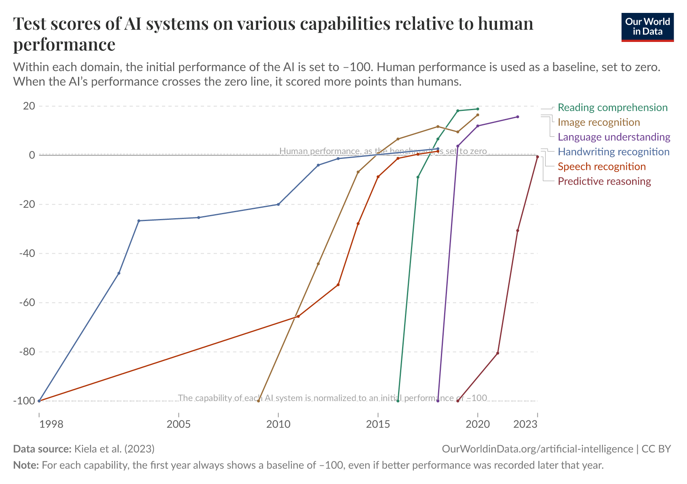

<!-- _class: portada -->

# El caso, la ruta y el horizonte

Sesión 8 de 8 · 2 h en vivo · **YPFB Andina**

<!--
0:00 · portada mientras entra la gente
Ventanas de hoy: A este deck, C el sitio en la sesión 8, D los resultados
del screening (terminal o carpeta con el ranking y los gráficos).
Sin pulsos hoy.
Antes de clase: el caso corrido y sus salidas listas en D; las preguntas de
aceptación de la sesión 6 a la vista; y las pestañas del bloque del futuro
abiertas: el gráfico de Our World in Data, el tablero de Epoch, el conteo
de LifeArchitect. Todo está linkeado en la página.
-->

---

## Hoy

| Bloque | Tiempo | Qué hacemos |
| --- | --- | --- |
| Apertura y entrada al sitio | 5 min | El PIN de siempre y las ventanas del día |
| El caso, en vivo | 30 min | El screening recorrido de punta a punta |
| La crítica | 20 min | El caso pasa por el protocolo de la sesión 7 |
| Hoja de ruta | 20 min | Mañana, noventa días, decisión corporativa |
| El futuro, conversado | 30 min | La frontera, AGI y ASI, los modelos locales y p(doom) |
| Cierre del curso | 15 min | Lo que queda, y una cosa distinta para el lunes |

<!--
2 min · acumulado 0:02
La misma tabla está en la página de la sesión 8.
Bajada del día: hoy se cierra el arco. El caso que eligieron, la ruta para
adoptarlo, y al final una hora de levantar la vista. Es la última sesión.
-->

---

## Al final de esta sesión van a poder

- Recorrer y **criticar el caso real**: necesidad, flujo, resultado
- Llevarse una **hoja de ruta** concreta por equipo
- Conversar el **futuro** con datos: la frontera, los modelos locales, los riesgos

<!--
1 min · acumulado 0:03
El tercero es distinto a todo lo anterior y se anuncia así: el bloque del
futuro es especulación declarada, para conversar. La única regla es la del
curso: separar el dato de la fe.
-->

---

<!-- _class: panel -->

## Entrá al sitio, como siempre

`mpodeley.github.io/curso-energia-ypfb`

Hoy usamos la página de la sesión 8. Tené a mano tus **dos anotaciones** de la tarea: la
crítica se hace con ellas.

<!--
2 min · acumulado 0:05
El PIN de siempre, por última vez. Plan del día en una frase: el caso, su
crítica, la ruta de cada equipo, y el horizonte.
-->

---

<!-- _class: seccion -->

## El caso, en vivo

Bloque 1 de 5 · **30 min**

<!--
Arranca 0:05, termina 0:35
-->

---

## La necesidad, como salió del relevamiento

El **screening de waterflooding**: dónde conviene inyectar agua, o revisar la que ya se
inyecta. Lo eligió el grupo; lo construyó el mismo loop de la sesión 6.

Hoy se mide contra las preguntas que escribieron **ustedes**.

<!--
5 min · acumulado 0:10
Recordar de quién salió el dolor y el techo fijado en la sesión 6:
screening con criterios, no simulación. La vara del bloque son las
preguntas de aceptación de la ronda, que están a la vista.
El resumen del caso está publicado arriba en la página: alcance, datos y
techo, para que nadie critique de memoria.
-->

---

<!-- _class: panel -->

## El flujo, de punta a punta

En vivo: los datos, los criterios, el agente y el ranking. Miren dónde interviene una
persona, y qué quedó **manual a propósito**.

<!--
18 min · acumulado 0:28
Ventana D. Recorrer en orden: la escalera de datos (el análogo del Capítulo
IV, y lo interno si viajó, con su nivel del mapa dicho en voz alta), los
criterios explícitos (corte de agua, tendencias, pares productor-inyector),
la corrida del agente, y el ranking con sus fuentes.
Mostrar también lo que falló o quedó a medias: el contrato de esta sesión
es resultado con honestidad, y las fallas del agente son material, no
vergüenza.
Ir tachando las preguntas de aceptación que el recorrido va contestando.
-->

---

## El resultado, con honestidad

Qué mejora y cuánto. Qué **no** mejoró. Qué sigue necesitando lupa de reservorista.

Un caso que solo muestra lo que funciona **no sirve para decidir**.

<!--
7 min · acumulado 0:35
El balance contra las preguntas de la sesión 6: cuáles quedaron
contestadas, cuáles a medias, cuáles no. Decir el costo real: horas del
instructor, corridas del agente, qué haría falta para repetirlo adentro.
Cierre del bloque 1.
-->

---

<!-- _class: seccion -->

## La crítica

Bloque 2 de 5 · **20 min**

<!--
Arranca 0:35, termina 0:55
-->

---

<!-- _class: panel -->

## Pásenlo por el protocolo

Ronda con la tarea: tus **dos anotaciones**. ¿Pasa el protocolo de verificación? ¿Respeta el
mapa de datos? ¿Qué pasa el día que se equivoque?

<!--
12 min · acumulado 0:47
Ronda por nombre: qué querías que muestre, y qué tendría que pasar para que
tu equipo lo use. Después las tres preguntas de la página, contra el caso.
Plan B si pocos leyeron el resumen: dos minutos para leerlo ahí mismo (está
arriba en la página) y anotar UNA objeción; con cinco personas alcanza.
Todo lo que salga se anota: la crítica es el entregable del bloque.
-->

---

## El día que se equivoque

Si mañana el ranking se equivoca y **nadie lo nota**, ¿qué pasa?

Si esa respuesta es grave, el flujo necesita otro control antes de usarse.

<!--
8 min · acumulado 0:55
Aplicada al caso: el screening es una lista de dónde mirar primero, no una
decisión de inversión. El control que le sigue es el de siempre: la lupa
del reservorista antes de mover un peso.
Cierre del bloque 2.
-->

---

<!-- _class: seccion -->

## Hoja de ruta

Bloque 3 de 5 · **20 min**

<!--
Arranca 0:55, termina 1:15
-->

---

<!-- _class: acentos -->

## Tres horizontes

- **Mañana**: lo que ya pueden usar sin pedir permiso, con las reglas de ayer
- **Noventa días**: un piloto acotado, con dueño y criterio de éxito escrito
- **Decisión corporativa**: contratos, datos, presupuesto, y quién responde

<!--
5 min · acumulado 1:00
Ejemplos del propio curso para cada horizonte: borradores asistidos y
triaje de documentos (mañana); el cuaderno de NotebookLM del área, o un
screening como el de hoy con datos internos (noventa días); la herramienta
contratada con acuerdo de datos (decisión corporativa).
Un piloto sin criterio de éxito escrito no termina nunca: se diluye.
-->

---

<!-- _class: panel -->

## La armamos por equipo

Cada uno: **una fila por horizonte**. Qué, quién, y cómo se mide. Al chat, y queda anotada.

<!--
10 min · acumulado 1:10
Ronda por nombre. Empujar hacia lo observable: no "usar más IA" sino "los
informes de turno salen con borrador asistido desde el lunes".
Las filas de todos van al chat: cada uno se lleva la suya y ve las de los
demás, que es de donde salen las mejores ideas.
-->

---

## Medir algo observable

"Horas ahorradas" es difícil de estimar y fácil de inflar.

Rinde más **contar cosas**: informes con borrador asistido, consultas resueltas sin
interrumpir a nadie, el análisis que tardaba una tarde.

<!--
5 min · acumulado 1:15
Cerrar el bloque con la advertencia de la página: lo que no se puede
observar, no se puede defender ante un directorio.
Cierre del bloque 3.
-->

---

<!-- _class: seccion -->

## El futuro, conversado

Bloque 4 de 5 · **30 min**

<!--
Arranca 1:15, termina 1:45
Aviso al entrar al bloque: acá cambia la vara y se declara. Lo que sigue es
especulación con nombre propio, para conversar. Las reglas de verificación
aplican también a los pronósticos.
-->

---

## Dónde está la frontera

Prueba tras prueba, los sistemas cruzan la **línea del desempeño humano**, y cada vez más
rápido.

Y el largo de tarea que un agente completa se sigue **duplicando cada siete meses**.

<!--
4 min · acumulado 1:19
El gráfico viene en la slide siguiente; el tablero de Epoch queda en
pestaña para el que quiera profundizar. El de METR ya lo vieron en la
sesión 6.
Si preguntan por el mundo físico: el video de Gemini Robotics está en los
recursos (tres minutos, Google DeepMind): el mismo tipo de modelo moviendo
un cuerpo completo. Ahí la regla de la sesión 7 vale doble.
-->

---

## La progresión, en un gráfico

Fuente: Our World in Data · CC BY

<!--
4 min · acumulado 1:23
Leerlo como enseñó el curso: decir qué mide cada eje antes de opinar. Cada
línea es una prueba estandarizada (comprensión, matemática, código) contra
la línea del desempeño humano, y el patrón es siempre el mismo: años por
debajo, cruce, saturación.
La advertencia honesta: un benchmark no es un puesto de trabajo, y las
pruebas se eligen porque se pueden medir. Aun así, la pendiente es el dato.
Este gráfico canónico llega a 2023: para lo último, cambiar a la pestaña
del tablero de Epoch, que está al día, y mostrar una prueba reciente
(matemática o código) con la misma forma de curva.
-->

---

## La frontera también se achica

Modelos que corren en una **laptop de trabajo**, sin mandar un byte afuera, hoy rinden como
los gigantes de hace dos años.

Para el mapa de datos de ayer, eso cambia el tablero: el **nivel 1** puede tener asistente
adentro de la red.

<!--
3 min · acumulado 1:26
Bajarlo a tierra: las familias abiertas chicas (Llama, Qwen, Gemma, Phi) en
tamaños de pocos miles de millones de parámetros corren en una notebook
buena o un servidor interno modesto.
La brecha con la frontera sigue existiendo; la sorpresa es la velocidad con
la que lo de ayer se vuelve local. Si el grupo quiere seguirla: es un
proyecto de sistemas con el mapa de datos como requisito, no un experimento
de escritorio.
-->

---

## AGI y ASI, definidos

**Inteligencia artificial general (AGI)**: desempeño al nivel de una persona competente en la
mayoría de las tareas cognitivas.

**Superinteligencia (ASI)**: por encima del mejor humano en casi todas. La letra chica: no hay
definición única, y por eso se discute tanto si la primera ya llegó.

<!--
4 min · acumulado 1:30
Los conteos de LifeArchitect (en los recursos) usan criterios propios y a
la vista: leerlos como pronóstico, mirando los supuestos. El título del
video de Kosinski juega justamente con la ambigüedad de la definición.
Para la sala: con la definición de arriba, ¿cuánto falta? ¿Y si la
definición fuera "hace tu trabajo de hoy"?
-->

---

## La mejora recursiva

La hipótesis de I. J. Good (1965): una máquina que **diseña máquinas mejores** dispara una
**explosión de inteligencia**.

La versión de hoy, sin ciencia ficción: los laboratorios ya usan sus modelos para construir
los siguientes.

<!--
4 min · acumulado 1:34
Good era matemático, colega de Turing. Su frase: la primera máquina
ultrainteligente sería el último invento que el hombre necesite hacer.
El dato aterrizado: buena parte del código de los laboratorios ya lo
escriben sus propios modelos, y la curva del largo de tarea es el
indicador que más miran los que toman esta hipótesis en serio.
Es el mecanismo detrás de los números de p(doom) que vienen enseguida: si
el loop se acelera, el control importa más.
-->

---

## La hipótesis de Kosinski

Un psicólogo computacional de Stanford, **para conversar**: la inteligencia artificial va a
reemplazar el trabajo científico y la mayoría de los usos prácticos del lenguaje.

<!--
3 min · acumulado 1:37
El video está en los recursos de la página; lo mejor son los últimos diez
minutos. Presentarla como lo que es: una hipótesis de alguien serio, no un
pronóstico del curso.
La pregunta que abre: si las máquinas hacen ciencia, ¿qué queda del trabajo
técnico? El puente natural es el ejemplo del mail, que viene ahora.
-->

---

## El mail de cuatro puntos

Vos escribís cuatro puntos. Un modelo los estira a un mail cortés. Del otro lado, otro modelo
lo vuelve a **cuatro puntos**.

Pero quizás no los tuyos: **los que le importan al receptor**.

<!--
3 min · acumulado 1:40
El ejemplo de Kosinski, y es mejor de lo que parece: no es que el mail
largo sobra, es que cada lado lee la versión que necesita. Un aumentador de
comunicación.
Las preguntas para la sala: ¿para qué está el mail largo del medio?
¿desaparece el género "mail cortés"? ¿qué pasa cuando los dos modelos
negocian qué es lo importante? Conectar con la sesión 3: lo que era una
herramienta de redacción empieza a parecer un protocolo entre máquinas.
-->

---

## p(doom)

El número con el que el rubro resume su miedo: la probabilidad que le asignás a una
**catástrofe existencial** por inteligencia artificial.

Va de casi cero a casi seguro según a quién le preguntes. **La dispersión es el dato.**

<!--
2 min · acumulado 1:42
Nombres para la conversación, sin caricaturizar: pioneros que se volvieron
cautos (Hinton dejó Google para poder hablar de esto), gente que lo
considera manejable, gente que lo descarta. No hay consenso: hay apuestas
razonadas, y la página linkea el panorama.
La pregunta para la sala no es el número ajeno sino el propio: ¿te
preocupa? ¿cambia algo de lo que hacés el lunes?
-->

---

## La nota optimista, con fuente

Machines of Loving Grace: la inteligencia artificial puede **comprimir décadas de progreso
científico** en años.

Y para esta industria: los centros de datos son **demanda eléctrica firme**, y buena parte de
esa electricidad es gas.

<!--
3 min · acumulado 1:45
El ensayo está linkeado en la página; el argumento fuerte es biología y
salud. Honestidad hasta en el optimismo: el mismo autor toma el riesgo en
serio; optimismo y cautela no son bandos, son la misma persona.
El ángulo propio: la demanda de los centros de datos ya mueve contratos de
gas en las Américas. Para una empresa de gas, el futuro de la IA también es
un mercado.
Cerrar el bloque con la mini ronda: ¿optimista o pesimista para tu
trabajo, y por qué? Una respuesta por cabeza; la única regla es distinguir
la afirmación con dato de la afirmación con fe.
Cierre del bloque 4.
-->

---

<!-- _class: seccion -->

## Cierre del curso

Bloque 5 de 5 · **15 min**

<!--
Arranca 1:45, termina 2:00
-->

---

<!-- _class: acentos -->

## Lo que se llevan del curso

- La salida de un modelo es un **borrador plausible**: la verificación es tuya
- Delegá lo **digital, acotado y verificable**, con el mapa de datos en la mano
- El techo **sube cada mes**: el protocolo es lo que permite subirse sin sustos

<!--
3 min · acumulado 1:48
Las dos semanas en tres frases, y la tercera es la optimista: esto mejora
rápido, y ustedes ya saben manejarlo con las reglas puestas.
-->

---

## El sitio queda abierto

Todo queda publicado: los ejercicios, los decks y sus PDF, los archivos descargables y la
política editable. La dirección es la misma de siempre.

<!--
3 min · acumulado 1:51
Invitarlos a volver: los ejercicios no caducan y el quiz de cada sesión
sigue ahí. El punto 5 de la política vale también conmigo: el caso nuevo
que aparezca, me lo escriben.
-->

---

## La última tarea: una película

- **2001, odisea del espacio** (1968): HAL, el agente con herramientas de más
- **Her** (2013): el asistente que conversa
- **Ex Machina** (2014): el test de Turing hecho thriller
- **Terminator** (1984): el p(doom) original
- **AlphaGo** (2017): documental, la máquina sorprende a los maestros

<!--
4 min · acumulado 1:55
La única tarea del curso sin plan B. Decirlo mitad en broma y mitad en
serio: después de estas dos semanas las van a ver distinto. HAL es
literalmente el bloque 4 de ayer; AlphaGo es la nota optimista en
documental.
-->

---

<!-- _class: panel -->

## Una cosa distinta, el lunes

Ronda de cierre, por nombre: **una sola cosa** que vas a hacer distinto el lunes, en una
frase.

<!--
4 min · acumulado 1:59
De viva voz, todos, sin panel. Anotarlas y pedirles que las peguen en el
chat: ese puñado de frases es el mejor resumen posible del curso, escrito
por ellos.
-->

---

<!-- _class: portada -->

# Gracias

El sitio queda abierto · **mpodeley.github.io/curso-energia-ypfb**

<!--
1 min · acumulado 2:00
Dejar proyectada mientras se despiden.
Después de clase: mandar por correo la política editable, las filas de la
hoja de ruta de cada equipo y las frases de la ronda final. El curso
termina; el contacto queda abierto.
-->
